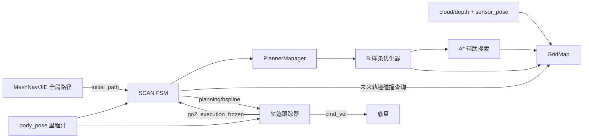

# SCAN-Planner 源码阅读指南：从零到自研 3D 导航

核对日期：2026-09-15。阅读对象是本项目 `SCAN-Planner/` 内的 ROS 2 移植实现，不是对原论文或其他分支的概括。下文以实际函数行为为准；“建议新增”表示设计建议，不表示已实现。本文只做源码解释，不构成运行或闭环验收报告。

目标路线：MeshNav 或 JIE 提供全场路径，SCAN 负责局部运动规划，轨迹跟踪器驱动全向底盘，导航管理层负责目标生命周期、阻塞反馈与全局重规划。DDDMR 暂作为参考。

## 1. 先理解五个概念

| 概念 | 解决的问题 | 例子 |
| --- | --- | --- |
| 全局路径 Path | 经过哪些可通行区域到达终点 | 经隧道 A，或绕行坡道 B |
| 局部轨迹 Trajectory | 接下来每个时刻应该到哪里，速度多大 | 未来几秒内减速、侧移并回到参考路线 |
| 轨迹跟踪 Controller | 根据实际位置误差生成执行指令 | 计算机体系 `vx、vy、wz` |
| 局部环境地图 | 当前周围哪里被占据 | 雷达看见另一台机器人及隧道顶棚 |
| 导航管理 Supervisor | 何时等待、改道、取消或宣告失败 | 隧道持续堵塞后通知全局规划器换路 |

“路径”主要表达几何，“轨迹”还表达时间。“规划器输出了一条轨迹”与“车辆实际走完这条轨迹”是两件事。

SCAN 的 `planGlobalTrajWaypoints()` 名字中虽然有 Global，但它是在给定路线点之间生成内部参考轨迹。它没有替代 MeshNav/JIE 的全场地图搜索，也没有自动知道隧道外是否存在另一条路。

### 最少需要的基础

- C++：类、成员变量、智能指针、引用、回调、枚举；先能追踪函数参数和返回值，不必先读懂所有模板。
- ROS 2：节点、话题、消息、参数、QoS、执行器、ROS 时间与墙钟时间。
- Eigen：`Vector3d` 是 XYZ 向量；`MatrixXd` 在此常用作 `3×N` 控制点矩阵，每列是一个点。
- 坐标变换：同一个点在地图系与车体系中坐标不同，不能仅靠修改 `frame_id` 完成转换。
- 数学：位置对时间求导得到速度，再求导得到加速度；了解曲线插值、代价函数和梯度的含义即可开始。

## 2. 目录与实际运行单元

从 [CMakeLists.txt](../SCAN-Planner/src/planner/plan_manage/CMakeLists.txt) 入手确认：目录叫 `plan_manage`，ROS 包名却是 **`scan_planner`**。

| 源码位置 | 作用 | 第一遍阅读重点 |
| --- | --- | --- |
| [plan_manage](../SCAN-Planner/src/planner/plan_manage/) | 节点、状态机、规划协调、控制器 | 首先读 |
| [plan_env](../SCAN-Planner/src/planner/plan_env/) | 滑动体素地图、射线更新、碰撞查询 | 然后读 |
| [path_searching](../SCAN-Planner/src/planner/path_searching/) | 优化器内部的 A* 绕障辅助路径 | 看搜索范围与占据查询 |
| [bspline_opt](../SCAN-Planner/src/planner/bspline_opt/) | B 样条表示、优化和时间调整 | 最后深入公式 |
| [traj_utils](../SCAN-Planner/src/planner/traj_utils/) | 多项式轨迹、可视化等工具 | 被调用时再展开 |
| [scan_planner_msgs](../SCAN-Planner/src/planner/scan_planner_msgs/) | 轨迹与调试消息 | 用来核对模块契约 |
| `src/simulator/` | 地图、模拟感知、机器人描述 | 理解演示环境，不当作规划算法 |

`scan_planner_node` 把 FSM、manager、地图和优化器放在同一进程内。它们多数通过 C++ 函数调用连接，并不是每个类都对应一个 ROS 节点。



图中“MeshNav/JIE → SCAN”是我们的目标连接；当前 PB 两套启动入口仍使用各自控制器，尚未完成这一组合。

## 3. 推荐阅读顺序：每一遍只回答一个问题

| 顺序 | 要回答的问题 | 入口 |
| --- | --- | --- |
| 1 | 启动了什么、数据从哪里来？ | `run.launch.py`、`CMakeLists.txt` |
| 2 | 一条路径如何变成局部规划请求？ | `scan_planner_node.cpp`、`scan_replan_fsm.cpp` |
| 3 | 请求如何变成 B 样条？ | `planner_manager.cpp` |
| 4 | 怎么知道车体会撞到障碍？ | `grid_map.cpp/.h` |
| 5 | 如何找绕障方向并优化曲线？ | `dyn_a_star.cpp`、`bspline_optimizer.cpp` |
| 6 | 曲线如何变成速度并被执行？ | `closed_loop_controller.cpp` |
| 7 | 哪些失败能恢复，哪些需要外部管理？ | FSM、控制器、消息定义交叉阅读 |

第一遍不要从 `lbfgs.hpp` 开始，也不要把可视化函数逐行读完。先沿一次调用链理解输入、输出、状态变化，再返回数学与边界处理。

## 4. 第一站：启动入口与输入契约

读 [run.launch.py](../SCAN-Planner/src/planner/plan_manage/launch/run.launch.py) 的 `_setup()`。

### 4.1 三个重要分支

- `navi_mode=1`：RViz 单目标；`2`：预设航点；`3`：外部参考路径。我们的主要入口是 3。
- `sensor_type=lidar/depth`：点云与深度图进入不同地图更新回调。
- `controller_mode=open_loop/closed_loop`：选择开环演示输出或使用实际位姿反馈的控制器。

当前 mode 2 还要求 `keypoints_file` 指向有效的参数 YAML。只记住 README 中的模式编号还不够，要看 launch 的参数校验。

### 4.2 当前话题契约

| 相对话题 | 类型 | 消费/生产位置 | 含义 |
| --- | --- | --- | --- |
| `initial_path` | `nav_msgs/msg/Path` | FSM 的 `pathCallback` | 外部路线；mode 3 才订阅 |
| `body_pose` | `nav_msgs/msg/Odometry` | FSM、控制器、地图 | 机器人参考点位姿；FSM 也读取速度 |
| `sensor_pose` | `nav_msgs/msg/Odometry` | GridMap | 射线起点及传感器姿态 |
| `cloud` | `sensor_msgs/msg/PointCloud2` | GridMap | 激光点云 |
| `depth` | `sensor_msgs/msg/Image` | GridMap | 深度观测 |
| `planning/bspline` | `scan_planner_msgs/msg/Bspline` | FSM → 控制器 | 局部曲线与时间信息 |
| `cmd_vel` | `geometry_msgs/msg/Twist` | 闭环控制器输出 | 机体系平面运动指令 |
| `planning/go2_execution_frozen` | `std_msgs/msg/Bool` | 控制器 → FSM | 转向对齐时冻结轨迹计时 |
| `planning/data_display` | `scan_planner_msgs/msg/DataDisp` | FSM 输出 | 简单调试数据，不是完整任务状态 |

`body_pose` 使用 SensorDataQoS；`initial_path` 采用深度 1 的普通订阅。接入外部规划器时要检查发布时机与持久化策略：过去发布过路径，不代表晚启动的 SCAN 一定能收到它。

### 4.3 坐标是第一项必查内容

仿真分支默认使用 `/quad_0/*`、世界系点云；实机分支默认 `/LIO/*`，点云需要转换。默认地图 frame 是 `world`，当前 PB 项目主要使用 `map`。直接重映射话题不足以保证语义一致。

特别看 `pathCallback()`：它取每个路径点的 XYZ，并执行 **`z += body_height_`**；没有在这里按 Path 的 frame 做 TF 转换，也没有使用路径 orientation 约束车头方向。

所以接入前要明确：外部路径点是地表点，还是车体参考点？比如地表 z=0、参考点高 0.4 m，内部目标变成 z=0.4 是合理的；如果上游已经给出 z=0.4，再加一次就错了。

**阅读练习**：在纸上写出 PB `/odom` 的参考点、雷达安装高度、全局 Path 的高度含义和 SCAN `body_height`，确认没有重复加高或重复旋转。

## 5. 第二站：状态机掌握“什么时候规划”

入口：[scan_planner_node.cpp](../SCAN-Planner/src/planner/plan_manage/src/scan_planner_node.cpp)。`main()` 创建节点、初始化 `SCANReplanFSM`，然后交给 `SingleThreadedExecutor`。

读 [scan_replan_fsm.cpp](../SCAN-Planner/src/planner/plan_manage/src/scan_replan_fsm.cpp) 时依次搜索：

```text
init
pathCallback
planGlobalTrajByWaypoints
execFSMCallback
getLocalTarget
callReboundReplan
checkCollisionCallback
finishProcess
```

### 5.1 一条新路径进来后

1. `pathCallback()` 拒绝空路径，提取并调整航点高度。
2. `planGlobalTrajByWaypoints()` 调用 manager 生成内部全局参考轨迹，并更新目标相关标志。
3. FSM 从等待或执行状态转入生成/重规划状态。
4. `getLocalTarget()` 沿内部参考轨迹寻找规划视距内的局部目标。
5. `callReboundReplan()` 请求 manager 生成局部 B 样条。
6. 成功后发布 `planning/bspline`，进入执行状态。

注意 `pathCallback()` 直接切换状态的分支只处理 `WAIT_TARGET` 和 `EXEC_TRAJ`。在急停或其他规划状态下替换路径的完整语义需要单独检查和测试，不能默认新 Path 在任何时候都能正确抢占旧任务。

### 5.2 六个状态

| 状态 | 主要行为 | 阅读时关注 |
| --- | --- | --- |
| `INIT` | 等里程计与触发 | `have_odom_`、`trigger_` |
| `WAIT_TARGET` | 等有效目标 | `have_target_` |
| `GEN_NEW_TRAJ` | 从当前起始状态生成轨迹 | 首次初始化与随机初始化 |
| `EXEC_TRAJ` | 根据轨迹进度决定继续或重规划 | 参考位置与真实位姿的差别 |
| `REPLAN_TRAJ` | 使用当前轨迹等信息再次规划 | 失败重试及连续失败计数 |
| `EMERGENCY_STOP` | 发布停止轨迹，等待停止或恢复 | 自动恢复与等待新目标两个分支 |

默认 FSM 墙钟定时器周期 10 ms，碰撞检查周期 50 ms。它们是请求调度周期，**不是保证每次规划耗时小于 10 ms，也不是独立并行的安全线程**。同一单线程执行器中的优化耗时会影响地图和安全回调的执行机会。

### 5.3 重规划的触发

执行中会根据参考轨迹位置与起点/终点的距离判断是否重规划。`fsm.thresh_replan=1.0` 是距离参数，不是“每 1 秒重规划”。另有碰撞检查和新路径触发。

`getLocalTarget()` 以 `last_progress_time_` 为线索遍历内部参考轨迹，按与起点的距离选择局部目标；若目标被占据，会沿参考轨迹尝试调整。它没有进行全场拓扑改道。

### 5.4 必须带着疑问读的两处

- `EXEC_TRAJ` 有依据局部轨迹时间结束而转回等待的分支；任务是否真正到达不能只读这个状态，应结合控制器误差和真实位姿确认。
- `finishProcess()` 连续失败到阈值后设置 `need_hover_stop_` 并进入急停；满足后续停止条件时清除目标、回到等待。默认阈值是 1000 次，次数与实际耗时没有固定换算关系。

**阅读练习**：分别画出“路径成功”“碰撞后局部绕开”“反复失败停住”的状态轨迹，并列出每条边的条件。

## 6. 第三站：manager 掌握“怎样生成轨迹”

读 [planner_manager.cpp](../SCAN-Planner/src/planner/plan_manage/src/planner_manager.cpp) 的 `initPlanModules()`、`reboundReplan()`，并对照 [plan_container.hpp](../SCAN-Planner/src/planner/plan_manage/include/plan_manage/plan_container.hpp)。

`global_data_` 保存长程参考；`local_data_` 保存当前可执行的局部位置、速度、加速度曲线，以及起始时间、时长、轨迹编号。

`reboundReplan()` 的输入是起始位置/速度/加速度、局部目标位置/速度以及初始化标志。返回 bool；成功结果保存到 `local_data_`。

### 6.1 三阶段流水线

1. **初始化**：从多项式或上一条轨迹取得采样点，构造边界导数，再通过 `parameterizeToBspline()` 得到控制点。失败时可能采用随机化初始化。
2. **优化**：`initControlPoints()` 寻找碰撞段并利用 A* 提供绕障参考；`BsplineOptimizeTrajRebound()` 优化控制点。
3. **时间调整与复查**：速度/加速度不可行时，执行 `refineTrajAlgo()`；最终通过检查后 `updateTrajInfo()` 保存结果。

失败结果不会作为新局部轨迹正常发布。但“没有新轨迹”不等于旧轨迹已被执行端取消，需要继续追踪 FSM 和控制器。

### 6.2 这里的 Dynamic 指什么

`checkDynamicFeasibility()` 采样检查轨迹速度和加速度的三维向量范数，并考虑配置容差。这里的 Dynamic 指运动可行性，**不是预测动态障碍物的运动**。

默认文件有 `manager.max_jerk`，但这个最终检查函数只检查速度、加速度。读参数时必须沿调用链确认它是否真的参与约束，不能因 YAML 出现名字就认定已实现硬限制。

### 6.3 本地版本的 Z 处理非常关键

`applyLinearZReference()` 按采样点的累计 XY 路程，在起始 Z 与局部目标 Z 之间做线性插值，并在参数化为 B 样条前调用。

这个处理不是沿真实地表查询高度。例如局部区间是“平地—上坡—平台”，仅用两端高度线性插值可能偏离中间地表。对我们要做的坡道、隧道和多层导航，应专门审计地面支撑与层归属。

**阅读练习**：给定起点 `(0,0,0.4)`、终点 `(4,0,1.4)`，先画线性 Z，再画实际“前两米平地、后两米上坡”的高度，观察偏差产生在哪里。

## 7. 第四站：地图从观测变成碰撞判定

先读 [grid_map.h](../SCAN-Planner/src/planner/plan_env/include/plan_env/grid_map.h) 的参数与数据结构，再读 [grid_map.cpp](../SCAN-Planner/src/planner/plan_env/src/grid_map.cpp)。

推荐函数顺序：`initMap → sensorPoseCallback → cloudCallback → updateOccupancyCallback → raycastProcess → applyOccupancyUpdate → updateInflation → updateSlidingMap`。

### 7.1 点云路线

`cloudCallback()` 要先获得 `sensor_pose`。输入为世界系点云时直接使用 XYZ；否则使用缓存的传感器旋转和平移转换点。它过滤非有限值、处理范围，缓存射线端点，随后由占据更新回调处理。

激光分支中点云和传感器位姿是分开订阅的，回调使用缓存的位姿。阅读时应检查时间同步、延迟和 TF 语义，不应因为输入消息有 header 就假定已完成时间对齐。

### 7.2 为什么要做射线更新

一个雷达点意味着端点附近可能有障碍；从传感器到端点的可见射线路径提供空闲证据。程序用 hit/miss 更新占据概率的 log-odds，并做上下限裁剪。

理解用的公式是：`L_new = clamp(L_old + L_hit_or_miss)`，其中 `L = log(p/(1-p))`。实际代码还处理多条射线的缓存与计数。

这解释了移动障碍离开后如何逐渐清除，也说明“没再看到”与“被射线观测为空”不同。遮挡处是否保留旧障碍、保留多久，要沿更新和滑动清理逻辑核查，不能把它当作完整的目标跟踪器。

### 7.3 滑动窗口

默认窗口 `10×10×5 m`、分辨率 `0.05 m`，约 400 万体素；程序还有多个缓存，因此这不是总内存字节数。减半分辨率在相同空间范围下会让体素数约增至八倍。

窗口随参考位置移动，清理离开的区域，并维护占据和膨胀信息。重点看 `updateSlidingMap()` 与膨胀计数更新是否一致，避免旧障碍留下幽灵膨胀或错误清除相邻障碍。

### 7.4 双圆柱碰撞近似

`getInflateOccupancy(pos, yaw)` 根据 yaw，在中心前后各取一个偏移点，再查询膨胀缓存；圆柱半径与上下膨胀在地图层参与处理。默认半径 0.25 m、前后偏移 0.18 m。

这是带朝向的近似车体，不是完整网格碰撞。查询签名只有位置和 yaw，没有把 roll/pitch 作为独立姿态参数。对于坡上俯仰、车顶净空和全向侧移，它的保守程度需要重新验证。

地图外查询返回 `-1`。调用点有的用 `!=0`，有的直接作为 bool：两者都会把 `-1` 当作非空闲。窗口内部未知体素与地图外不是同一概念，要另查占据初始化和阈值，不要混为一谈。

**阅读练习**：追踪一个障碍从出现、重复观测、离开到清除的全过程，再检查膨胀层何时变化。

## 8. 第五站：A* 是优化器的辅助，不是我们的全局选型

入口：[dyn_a_star.cpp](../SCAN-Planner/src/planner/path_searching/src/dyn_a_star.cpp)。

先找起终点调整、open set、邻居展开、`gScore/fScore`、占据检查和回溯路径。`g` 是已走代价，`h` 是到终点的估计，`f=g+h` 决定优先展开顺序。

当前版本邻居循环只有 `dx、dy`，Z 通过 `interpolateZIndexOnSearchPlane()` 从搜索起终点插值得到。虽然节点存储在三维网格中，但不能把它理解为任意 XYZ 空间的 26 邻域搜索，更不能等同于地表支撑约束搜索。

文件名 `dyn_a_star` 也不证明它实现了带时间维度的动态机器人预测。我们仍需要外部全局规划器决定跨通道路线。

## 9. 第六站：B 样条与优化

先读 [uniform_bspline.cpp](../SCAN-Planner/src/planner/bspline_opt/src/uniform_bspline.cpp)，再读 [bspline_optimizer.cpp](../SCAN-Planner/src/planner/bspline_opt/src/bspline_optimizer.cpp)。

### 9.1 曲线如何表示

可以先把 B 样条理解成“由控制点牵引的平滑曲线”。控制点通常不是机器人必须逐点经过的位置。

基本表达：`p(t) = Σ N_i,k(t) Q_i`，`Q_i` 是控制点，`N_i,k` 是由阶次与节点向量决定的基函数。这里常用三次 B 样条。源码消息字段名为 `order`，阅读数学资料时注意有的资料用 order 指次数加一，以代码约定为准。

- `evaluateDeBoorT(t)`：按轨迹相对时间取得位置。
- `getDerivative()`：得到速度曲线，再调用一次得到加速度曲线。
- `parameterizeToBspline()`：从采样点与边界导数构造控制点。
- `checkFeasibility()`：检查运动限制，必要时建议调整时间。

时间间隔增大通常降低曲线速度与加速度，但不能忽略控制器执行时钟与碰撞复查。

### 9.2 优化器实际最小化什么

第一阶段 `combineCostRebound()`：

`J = λ_smooth J_smooth + λ_collision J_distance + λ_feasibility J_feasibility`

细化阶段 `combineCostRefine()`：

`J = λ_smooth J_smooth + λ_fitness J_fitness + λ_feasibility J_feasibility`

| 成本 | 函数 | 直观含义 |
| --- | --- | --- |
| 平滑 | `calcSmoothnessCost` | 避免控制点变化过于剧烈 |
| 碰撞距离 | `calcDistanceCostRebound` | 根据绕障参考与约束方向推离障碍 |
| 运动限制 | `calcFeasibilityCost` | 惩罚超出速度/加速度限制 |
| 参考拟合 | `calcFitnessCost` | 细化时保持与参考轨迹的关系 |

先看这两个组合函数，再读各成本与梯度，最后才读 L-BFGS 求解器。优化不是一次就必然成功的“最短路算法”，初始化、局部约束、终止条件都会影响结果。

两个组合函数都执行 **`grad_3D.row(2).setZero()`**。结合初始化中的线性 Z，当前实现主要优化 XY，不能宣传成任意地形上的完整三维自由优化。

`initControlPoints()` 和 `check_collision_and_rebound()` 将碰撞段与 A* 辅助路线联系起来；`rebound_optimize()`、`refine_optimize()` 还进行采样碰撞检查。软成本与离散复查都需要结合分辨率、采样间隔和车体模型评估，不能视为连续扫掠体的严格无碰撞证明。

### 9.3 朝向与全向底盘的关系

优化器的 yaw 估计会参考控制点/轨迹段方向；FSM 的轨迹碰撞检查也按相邻轨迹点估计 yaw。对全向底盘而言，移动方向可以不等于车头方向。若执行器保持车头而侧移，规划碰撞模型使用的朝向必须与执行策略一致。

**阅读练习**：画一辆长方形车朝前侧移的情形，比较“车头 yaw”与“路径切线 yaw”对应的碰撞外廓。

## 10. 第七站：从曲线到速度

读 [closed_loop_controller.cpp](../SCAN-Planner/src/planner/plan_manage/src/closed_loop_controller.cpp)，按 `bsplineCallback → odomCallback → cmdCallback` 的顺序。

### 10.1 实际跟踪策略

1. 收到 Bspline 后重建位置、速度、加速度曲线，执行时间清零。
2. 用未来参考点/速度估计期望 yaw。
3. yaw 误差过大时停止平移、保留转向，并发布 execution frozen。
4. 对齐后推进执行时间，用“参考速度 + 位置误差比例反馈”计算世界系平面速度。
5. 按实际 yaw 转成机体系，分别限制 `vx、vy、wz`。
6. 执行时间到末尾且平面位置误差小于 `finish_dist` 时输出零。

平面变换为：

```text
vx_body =  cos(yaw) * vx_world + sin(yaw) * vy_world
vy_body = -sin(yaw) * vx_world + cos(yaw) * vy_world
```

源码中的 `publishStop(yaw_rate)` 可以包含非零角速度，所以看到 Stop 名字不能认为车辆完全静止。

### 10.2 时间契约需要重点读

Bspline 消息有 `start_time`，但当前控制器收到轨迹后从本地 `exec_time_=0` 开始，并没有据此字段补偿传输延迟。FSM 则用局部轨迹的开始时间求进度，并通过 frozen 反馈调整冻结过程。延迟、重发、替换和暂停场景都值得单独测试。

控制器目前用 `have_odom_` 判断是否收到过里程计，未在这条逻辑中检查里程计新鲜度，也没有完整的任务取消/故障状态接口。这些应由自研执行层补齐。

### 10.3 输出还不能直接接 PB 安全入口

SCAN 当前控制器输出 `Twist`，PB 选择器接收特定来源的 `TwistStamped` 并检查 frame 与时间戳。需要明确的适配和控制源管理，同时停用原 MeshNav/JIE 执行控制器，避免多源竞争。

开环控制器与 `go2_kinematic_sim` 用于理解算法和跟踪逻辑；它们的结果不能证明 PB Gazebo 物理底盘、坡道接触和隧道净空已经通过。

## 11. 把“隧道被机器人堵死”沿源码走一遍

### 11.1 现有代码能走到哪里

```text
雷达看到障碍
  → GridMap 更新占据/膨胀
  → checkCollisionCallback 检查未来局部轨迹
  → 尝试 planFromCurrentTraj
  → 成功：继续局部绕行
  → 失败：按预计碰撞时间进入重规划或急停
  → 连续失败达到阈值：停止并等待新目标
```

安全检查按 0.01 s 采样未来曲线，并在部分时段只检查轨迹前 2/3；`emergency_time` 比较的是沿参考时间到碰撞点的间隔。这个机制不包含其他机器人的未来轨迹预测。

### 11.2 我们建议新增的闭环

```text
局部状态 + 真实进度 + 障碍观测
  → 导航管理层判断短暂让行或持续堵塞
  → 更新对应高度/通道的临时阻塞信息
  → MeshNav/JIE 从当前真实位姿重新规划
  → 检查新路径确实避开阻塞且属于当前任务
  → 安全替换 SCAN 参考路径
  → 障碍消失后按观测规则解除阻塞
```

建议接口至少表达：任务 ID、路径版本、状态、失败原因、观测时间、阻塞范围或通道 ID、最后有效进度。这里是待设计的协议，现有 `DataDisp` 只有 header 与 a～e 数值，不能替代它。

不能把每次局部优化失败都判成隧道封闭。定位过期、地图缺失、目标在窗口外、底盘不跟踪、优化超时也可能表现为“走不动”。无替代路线时应保留等待/失败语义，不能保证一定能绕行。

动态障碍自研可分两步：先完成实时占据更新下的减速、停车和绕行，再引入目标跟踪、速度估计和时域预测。必须分别记录可见性、观测延迟、清除延迟与实际最小距离。

## 12. 参数阅读表：先弄清含义，再调大小

来源：[planner.yaml](../SCAN-Planner/src/planner/plan_manage/config/planner.yaml)、[controllers.yaml](../SCAN-Planner/src/planner/plan_manage/config/controllers.yaml)。以下是当前默认配置，不是 PB 推荐值。

| 参数 | 默认 | 主要影响/阅读问题 |
| --- | --- | --- |
| `fsm.planning_horizon` | 7.5 m | 局部目标选多远；需与观测范围/窗口匹配 |
| `manager.planning_horizon` | 7.5 m | 初始化等内部尺度；不能只改 FSM 一处 |
| `fsm.thresh_replan` | 1.0 m | 参考轨迹进度触发，不是秒 |
| `fsm.emergency_time` | 1.0 s | 参考轨迹上的碰撞时间阈值 |
| `fsm.max_replan_fail_count` | 1000 | 次数阈值；不等于固定等待时长 |
| `grid_map.resolution` | 0.05 m | 细节、计算量、内存 |
| `grid_map.max_ray_length` | 5 m | 可更新的射线范围 |
| `grid_map.body_height` | 0.4 m | 路径地表点到参考点的高度处理 |
| `double_cylinder_radius/offset` | 0.25/0.18 m | 碰撞外廓近似 |
| `manager.max_vel/max_acc` | 0.75/0.5 | 轨迹限制，需连同容差看 |
| `optimization.max_vel/max_acc` | 0.75/0.5 | 优化惩罚尺度，应与执行能力一致 |
| `control_points_distance` | 0.2 m | 曲线自由度与计算成本 |
| `heading_error_threshold` | 0.8 rad | 先转向、冻结平移的阈值 |
| `time_forward` | 0.8 s | 控制器期望朝向的前视时间 |
| `max_vx/max_vy/max_vyaw` | 0.75/0.35/1.0 | 实际输出限幅，单位 m/s、m/s、rad/s |

例子：规划视距 7.5 m、最大射线 5 m、窗口水平半宽约 5 m，并不能保证任意方向 7.5 m 内地图有效。应结合窗口中心和未知空间策略检查，而不是孤立调大视距。

## 13. 不改代码也能完成的阅读练习

在项目根目录查函数和调用位置：

```bash
cd /home/rainple/nav_test
rg -n 'pathCallback|callReboundReplan|getLocalTarget|finishProcess' SCAN-Planner/src/planner/plan_manage
rg -n 'getInflateOccupancy|applyLinearZReference|row\(2\).setZero' SCAN-Planner/src/planner
rg -n 'create_subscription|create_publisher|create_wall_timer' SCAN-Planner/src/planner
rg -n 'start_time|exec_time_|have_odom_' SCAN-Planner/src/planner/plan_manage/src/closed_loop_controller.cpp
```

为每个核心函数做一张简短笔记：输入是什么、修改了哪些成员、失败返回什么、谁调用它、下一步由谁执行。完成以下六题后再改算法：

1. 从一条 `initial_path` 追到一次 Bspline 发布，逐个写出函数名。
2. 区分真实位姿 `odom_pos_`、参考轨迹位置和局部目标；找出哪些判断用了参考位置。
3. 从一个点云障碍追到 `getInflateOccupancy()` 返回非零。
4. 解释 A* 的 Z 与优化器的 Z 分别如何得到。
5. 解释转向时控制器和 FSM 如何同步冻结时间。
6. 找到局部失败后没有向外部全局规划器发起请求的位置。

### 可选的构建与现有测试

下列命令由读者需要时执行；本次编写文档没有启动构建或仿真。只在 SCAN 工作区构建，避免在总项目根目录扫描重复 ROS 包。

```bash
source /opt/ros/humble/setup.bash
cd /home/rainple/nav_test/SCAN-Planner
colcon list
colcon build --symlink-install --cmake-args -DCMAKE_BUILD_TYPE=Release
source install/setup.bash
colcon test --packages-select scan_planner bspline_opt
colcon test-result --verbose
```

先读现有测试再运行：[启动测试](../SCAN-Planner/src/planner/plan_manage/test/test_planner_startup.py)、[航点参数测试](../SCAN-Planner/src/planner/plan_manage/test/test_waypoint_parameters.py)、[B 样条测试](../SCAN-Planner/src/planner/bspline_opt/test/test_uniform_bspline.cpp)。这些覆盖部分启动与数学行为，不是动态避障或物理闭环验收。

## 14. 自研修改的建议顺序

1. **接口与观测**：统一 frame、参考点、Path 高度、任务/路径 ID、时间和状态；能解释每一次失败。
2. **执行与停止**：建立全向底盘跟踪器的朝向策略、速度/加速度限制、输入过期停车和取消语义；先验证实际运动响应。
3. **地形约束**：处理局部轨迹的地面支撑、坡度、层归属和车体姿态净空，重点检查当前线性 Z 与固定 Z 优化策略。
4. **局部动态障碍**：观测进入地图，车辆实际减速/绕行/停车，障碍移除后正确清除。
5. **全局更新闭环**：持续阻塞反馈、临时通道代价、新路径替换、解封与防止反复切路。
6. **性能与复杂场景**：优化耗时分位数、回调延迟、点云吞吐、相遇避让和长时间运行。

每一阶段都保留全局路径、局部轨迹、实际速度指令、真实位姿、规划/控制状态和结果。轨迹漂亮、编译通过或开环跑通，都不能替代动态环境下的真实执行验证。

## 15. 与现有文档的分工

- 本文：沿源码建立理解，解释当前行为与自研接口。
- [部署手册](../SCAN-Planner/docs/DEPLOYMENT_GUIDE.md)：车体碰撞、执行器和工程部署的更细检查项；其中建议接口要与实际代码区分。
- [全向舵轮快速验证](../SCAN-Planner/docs/SWERVE_QUICK_VALIDATION.md)：后续部署阅读材料，本轮范围仍为仿真。
- [三框架仿真实施与记录](THREE_PLANNERS_PB_SIM_IMPLEMENTATION.md)：保留既有集成历史与未通过项；我们的主路线已调整为 SCAN + MeshNav/JIE，应以新的技术决策为准。

读完本文应能独立说明：一条全局路径如何变成局部轨迹、点云如何影响曲线、曲线如何变成速度、失败在哪里结束，以及哪些部分必须由我们的导航系统补齐。
