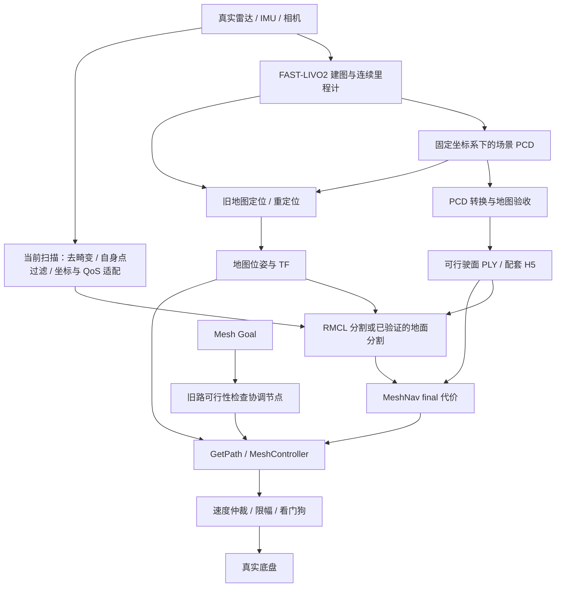

# FAST-LIVO2 → PCD → MeshNav 真机测试指南

更新：2026-09-27。依据本仓库 `d8036b2` 及当日读取的源码编写。

文档位于仓库根目录 `/home/rainple/nav_test`；ROS 2 工作空间为其下的 `mesh_navigation_tutorials`。本文只讨论 MeshNav + MeshController，不涉及其他导航框架。

**目标：先证明建图、定位、障碍感知和底盘接口分别正确，再验证全向导航及“旧路可行就不换路”的行为。换用真机可以排除 Gazebo 渲染、仿真时间和接触模型的影响，但不会自动修复地图、向量场或重规划代码的问题。**

## 1. 当前具备什么，还缺什么

| 项目 | 当前状态 | 真机工作 |
|---|---|---|
| PCD → 可行驶面 PLY | 已有 `field/pcd_to_nav_mesh.py` | 使用真实场地 PCD，按车辆能力重新验收 |
| MeshNav 网格、静态/动态代价层 | 已有 | 切换地图、缓存、车体参数和真实时钟 |
| MeshController 全向控制 | 已有，`holonomic: true` | 校验 vx、vy、wz 的方向、单位与底盘能力 |
| 旧路保留协调节点 | 已有 `meshnav_navigator` | 可以独立运行，无需 Gazebo |
| FAST-LIVO2 驱动、外参、时间同步 | 本次未提供实际部署版本 | 现场确认并冻结配置 |
| 重启后对旧地图定位 | 本仓库未提供 FAST-LIVO2 的完整接入 | 需要实际定位模块，或经验证的短时初始化方案 |
| 真机里程计/TF 适配 | 不能用 Gazebo 真值代替 | 由实际里程计、定位节点和标定外参提供 |
| 真实底盘速度接口与停止机制 | PB 仿真适配器不能代表实车接口 | 对接底盘驱动、速度仲裁、失联停车 |
| 真机总 launch | 当前没有已验证的专用入口 | 第 8 节提供待落地模板，驱动部分需现场接入 |

本文是操作与接入指南；文中的真机 YAML、launch 是**需要创建和填写的模板**，本次只交付文档，不会自动改动当前仿真参数，也没有声称已完成实车驱动适配。

当前读取的导航 YAML 中，`mesh_map.obstacle.robot_height` 为 **0.05 m**，旁边注释仍描述 0.50 m；静态/动态内圈分别为 0.15/0.35 m。这是当前配置快照，**不是实车推荐参数**。后续以实际参数回读和测量为准，不根据旧注释判断是否生效。

### 1.1 先填现场信息

| 内容 | 现场填写 |
|---|---|
| FAST-LIVO2 仓库 URL、分支、commit；ROS 1 / ROS 2 | 待填 |
| 上位机系统、ROS 发行版、CPU/GPU、是否分布式 | 待填 |
| 雷达型号、驱动版本、点云格式、时间戳来源 | 待填 |
| IMU、相机、内参、外参、同步方式 | 待填 |
| 整车含附件的长 L、宽 W、最高碰撞高度 H | 待填，单位 m |
| 前后左右突出物、雷达/相机是否高于车顶 | 待填 |
| 最大允许坡度、可跨台阶、最小实测刹车减速度 | 待填 |
| 底盘命令话题、消息类型、参考坐标系、失联超时 | 待填 |
| 实际里程计话题、pose/twist 坐标、是否发布 TF | 待填 |
| 地图定位方案、初始位姿输入方式、失效判据 | 待填 |

未确认 FAST-LIVO2 版本时，不能照搬某个 ROS 2 分支的 launch 名字。官方当前 README 使用 catkin 和 `roslaunch`，属于 ROS 1 用法；你们若使用 ROS 2 移植版，应以该仓库为准。[FAST-LIVO2 官方说明](https://github.com/hku-mars/FAST-LIVO2)

## 2. 总体流程与接口



地图有不同用途，必须区分：

- **场景 PCD**：保存地面、墙、柱、天花板等结构，用于检查建图与旧地图定位。
- **导航 PLY**：机器人能够行驶的表面。不能把墙、顶棚直接当作行驶面。
- **H5**：MeshNav 的工作缓存，依赖 PLY 和代价参数；不提供 SLAM 重定位。
- **当前扫描**：实时障碍输入。不能用累计建图点云替代，否则移动物体会留下历史点。

### 2.1 约定导航侧接口

以下名称是本文模板约定，真实驱动通过适配或 remap 接入。

| 接口 | 类型 | 约束 |
|---|---|---|
| `/cloud` | `sensor_msgs/msg/PointCloud2` | 当前扫描，XYZ 在真实雷达坐标系内，采样时间有效；本文 RMCL 入口需要 Reliable 发布 |
| `/obstacle_points` | `sensor_msgs/msg/PointCloud2` | 非地面障碍点，保留时间戳与正确 frame，不能混入自身车体 |
| `/odom` | `nav_msgs/msg/Odometry` | 连续里程计，必须提供可信实际速度，不能只有 pose、twist 全为零 |
| `/tf`、`/tf_static` | TF | `map` 到导航车体参考点、雷达在扫描时间可查询 |
| `/nav/cmd_vel` | `geometry_msgs/msg/Twist` | MeshNav 原始车体系速度，尚未直接连接电机 |
| 底盘最终命令话题 | 现场确定 | 由经过验收的仲裁/驱动接收；允许 Twist 或实际协议 |
| `/rviz/goal_pose` | `geometry_msgs/msg/PoseStamped` | `frame_id: map`，目标落在正确层的网格上 |
| `/meshnav_navigator/status` | `std_msgs/msg/String` | JSON：状态、执行路径计数、阻断段等 |

**速度必须经过一个明确的最终发布者。** 遥控、导航、驻停控制不能同时直接写电机命令；底盘侧应在命令过期、急停、导航撤销或定位失效时停止。不能只依赖 ROS 节点正常退出时发出的最后一条零速度。

## 3. FAST-LIVO2 建图

### 3.1 版本与 ROS 环境

推荐保留你们已经验证过的 FAST-LIVO2 建图环境。先记录版本，再决定如何把在线数据接到 ROS 2 Humble：

- **ROS 2 FAST-LIVO2**：可直接按接口对接，检查消息定义、QoS、时间戳和 TF。
- **ROS 1 FAST-LIVO2**：离线 PCD 可以直接复制到本仓库；在线导航还需要桥接标准消息或经过验证的转换进程。不要把“能复制 PCD”当作实时接口已打通。
- `ros1_bridge` 需要可共存的 ROS 1/ROS 2 构建环境。官方说明对 Ubuntu 22.04 + Humble 的组合列出源码构建限制；不能假定当前机器安装一个包就能桥接。优先桥接 `PointCloud2`、`Odometry`、TF 等标准接口；Livox 自定义消息只有在对应接口参与桥接构建后才可能支持。[ros1_bridge 官方说明](https://github.com/ros2/ros1_bridge)

ROS 1、ROS 2 普通工作终端分别加载各自环境；只在专门的桥接终端按桥接工程要求加载两套环境。

建议为建图数据建立独立目录：

```bash
cd /home/rainple/nav_test
mkdir -p field/real/site01_v1/{raw,calibration,reports,mesh}
mkdir -p mesh_navigation_tutorials/diagnostics/real_site01
```

保存软件 commit、驱动配置、FAST-LIVO2 YAML、相机标定和整车传感器外参。后续更换外参、地图坐标或重建地图时使用新的版本目录。

### 3.2 标定与采集

1. 固定雷达、IMU、相机安装，检查支架松动和电机振动；测量雷达到车体导航参考点的外参。
2. 按实际 FAST-LIVO2 版本确认 LiDAR–IMU、LiDAR–Camera 变换的方向，不能仅凭参数名字猜测是正变换还是逆变换。
3. 确认雷达逐点时间、IMU 时间、图像曝光时间处于相容时间基准；跨机器同步系统时钟，记录同步偏差。
4. 按该版本的惯导初始化要求起步；慢速走完整个场地，补扫地面、转角、坡道上下端、隧道内地面。
5. 对关键窄通道从两侧重复采集，覆盖车体将经过的整个宽度，避免仅扫描到墙或顶棚。
6. 尽量减少建图期间的移动物体；保留原始 bag，以便定位误差与地图缺洞可以回放分析。
7. 回到起点检查墙面重影、地面分层及重复经过处的偏差。绕回起点本身不证明系统执行了回环优化。

FAST-LIVO2 的 PCD 导出设置在官方 Avia 示例中包括 `pcd_save_en`、`type`、`filter_size_pcd`、`interval`。其中 `type: 0` 表示世界系输出，`interval: -1` 表示累计保存；具体版本的实际保存行为必须核对源码，不能把这个 Avia 文件整体用于其他雷达。[官方参数示例](https://github.com/hku-mars/FAST-LIVO2/blob/main/config/avia.yaml)

```yaml
# 仅是官方 ROS 1 参数结构示意，不是本项目 ROS 2 参数文件。
pcd_save:
  pcd_save_en: true
  type: 0                 # 地图世界系；不要直接拼接未经位姿变换的 body 系分帧。
  filter_size_pcd: 0.05    # 示例导出分辨率，须按点密度和最小结构尺寸选定。
  interval: -1            # 小场地可用；长时间累计可能占用大量内存。
```

官方当前 `LIVMapper.cpp` 在正常结束循环后调用 `savePCD()`，相关输出包括 `Log/pcd/all_raw_points.pcd`，视觉分支还可能输出降采样文件。因此应正常退出并确认落盘，避免强杀丢失缓存。该源码的默认里程计帧名为 `camera_init` / `aft_mapped`，并有使用发布时间的代码；你们的版本必须实查，不能假设它已经输出导航需要的测量时刻、车体系和速度。[官方发布与保存实现](https://github.com/hku-mars/FAST-LIVO2/blob/main/src/LIVMapper.cpp)

### 3.3 PCD 接收标准

将选定 PCD 复制为：

```text
/home/rainple/nav_test/field/real/site01_v1/raw/site01.pcd
```

随 PCD 写一份 `map_metadata.yaml`，至少记录：

```yaml
site: site01
version: v1
source_frame: 填写建图世界系
navigation_frame: map
units: m
# T_map_slam 把原建图坐标转换到最终导航 map 坐标；以下由标定结果填写。
T_map_slam: 待填写4x4矩阵
slam_commit: 待填
calibration_version: 待填
pcd_sha256: 待填
```

验收内容：米制尺寸、重力方向、地面覆盖、墙厚/重影、关键通道净空、重复经过误差、动态残影。Z 原点可以在传感器初始位置，地面 Z 为负不构成错误；不能为了让地面变成 0 而只移动 PCD，却忘记实时定位也需要同样的坐标变换。

## 4. PCD → 可行驶面 PLY → H5

### 4.1 使用已有转换器

在项目根目录执行；转换虚拟环境仅用于离线工具，不要用它启动 ROS 节点：

```bash
cd /home/rainple/nav_test
# 已有此虚拟环境时直接使用；首次建立时执行下面两行。
python3 -m venv field/.step_convert_venv
field/.step_convert_venv/bin/pip install -r field/requirements-conversion.txt

field/.step_convert_venv/bin/python field/pcd_to_nav_mesh.py inspect \
  field/real/site01_v1/raw/site01.pcd \
  --report field/real/site01_v1/reports/pcd_inspection.json
sha256sum field/real/site01_v1/raw/site01.pcd
```

脚本支持 PCD `ascii` 和未压缩 `binary`，至少需要 XYZ；额外强度/颜色字段可以保留。遇到 `binary_compressed`，先保留原文件，再用 PCL 工具转成普通 binary：

```bash
pcl_convert_pcd_ascii_binary input_compressed.pcd output_binary.pcd 1
```

转换器的 `--scale` 负责单位倍率，`--translate` 仅负责平移，**不负责旋转校正**。需要重力对齐或地图旋转时，使用经过验证的点云变换工具生成新文件，保存变换矩阵，并同步修改在线定位到 map 的变换。不要反复手动旋转几个副本而不记录来源。

### 4.2 参数选择与转换命令

先填写以下 Bash 变量，然后执行转换。示例分辨率用于首次检查；最大坡度和整车高度必须填写测量结果：

```bash
cd /home/rainple/nav_test
read -r -p '整车最高碰撞包络高度加净空余量，单位 m: ' VEHICLE_CLEARANCE_HEIGHT
read -r -p '已验证可通行的最大坡度，单位 deg: ' VEHICLE_MAX_SLOPE
export VEHICLE_CLEARANCE_HEIGHT VEHICLE_MAX_SLOPE

field/.step_convert_venv/bin/python field/pcd_to_nav_mesh.py convert \
  field/real/site01_v1/raw/site01.pcd \
  field/real/site01_v1/mesh/site01_nav.ply \
  --scale 1.0 --translate 0 0 0 \
  --voxel-m 0.025 --normal-k 24 --grid-m 0.10 \
  --max-slope-deg "${VEHICLE_MAX_SLOPE:?必须填写实测坡度}" \
  --layer-merge-m 0.04 \
  --robot-height-m "${VEHICLE_CLEARANCE_HEIGHT:?必须填写整车净空高度}" \
  --min-points-per-cell 3 --min-component-area-m2 1.0 \
  --report field/real/site01_v1/reports/site01_nav.pcd_to_mesh.json
```

| 参数 | 作用与调整依据 |
|---|---|
| `voxel-m` | 输入降采样尺度；过大可能抹去窄坡、台阶边缘 |
| `grid-m` | 输出表面网格尺度；过小且点稀疏时会碎裂，过大可能错误跨越缺口 |
| `normal-k` | 无可靠法向时估计法向的邻点数；跨越两个不同面时可能混入错误法向 |
| `max-slope-deg` | 依据真实抓地、负载和稳定性测试，不能照搬算法默认 55° |
| `layer-merge-m` | 同一 XY 柱中的高度聚类阈值；过大可能合并上下层 |
| `robot-height-m` | 离线净空筛选高度，包含会发生碰撞的雷达/相机/附件和余量 |
| `min-points-per-cell` | 支撑一个候选表面所需点数；降低不等于缺失地面得到证实 |
| `min-component-area-m2` | 连通分量面积筛选；0 表示只保留最大块，不是“完全关闭筛选” |

**离线净空高度和在线 `mesh_map.obstacle.robot_height` 是两个不同概念。** 后者是障碍点向网格投影的最大距离，详见第 7 节。两者不能因为都叫 robot_height 就强行填写同一个数。

点云没有提供完整自由空间证据。仅靠几何法向不能可靠区分所有地板、桌面、楼顶和天花板；需要对原始 PCD 与 PLY 叠加检查。若手工删除/补齐三角形，应生成新版本并记录依据。

### 4.3 地图验收与无电机规划

检查转换 JSON 的输入/输出路径、哈希、边界、连通分量及保留面积。为每条隧道、坡道、回程和跨区域路线各选一组起终点，Z 使用实际导航表面高度。

```bash
# SX SY SZ GX GY GZ 为本场地实际选点；R 为后文确定的保守包络半径。
field/.step_convert_venv/bin/python field/check_nav_mesh_route.py \
  field/real/site01_v1/mesh/site01_nav.ply \
  --start "$SX" "$SY" "$SZ" --goal "$GX" "$GY" "$GZ" \
  --clearance-m "$R" \
  --report field/real/site01_v1/reports/route_01.json
```

该脚本只预检起终点贴近网格、几何连通及端点边界距离，不能代替整条路线的碰撞验收。

已有 `meshnav_map_test.launch.py` 可以预览 PCD、PLY 和 GetPath，但它会把 MBF 速度映射到 `/cmd_vel`。**预览时不要接通真实底盘订阅；只运行 `meshnav_plan_only`，不要发送 ExePath。** 该入口的地图参数、H5、静态膨胀参数必须显式传入实车值，不能沿用旧场地示例：

```bash
source /opt/ros/humble/setup.bash
source /home/rainple/nav_test/mesh_navigation_tutorials/install/setup.bash
ros2 launch mesh_navigation_tutorials meshnav_map_test.launch.py \
  mesh_map_path:=/home/rainple/nav_test/field/real/site01_v1/mesh/site01_nav.ply \
  mesh_map_working_path:=/home/rainple/nav_test/mesh_navigation_tutorials/site01_v1_preview.h5 \
  source_pcd_path:=/home/rainple/nav_test/field/real/site01_v1/raw/site01.pcd \
  publish_source_cloud:=true \
  static_inscribed_radius:="$R" \
  static_inflation_radius:="$R_OUTER" \
  height_diff_threshold:="$STEP_LIMIT"
```

`R_OUTER >= R`；`STEP_LIMIT` 是结合网格分辨率与车辆台阶能力验收的高度差阈值。这些变量须在对应终端填写，不能使用空字符串。

另一终端运行：

```bash
ros2 run mesh_navigation_tutorials meshnav_plan_only \
  --start "$SX" "$SY" "$SZ" --goal "$GX" "$GY" "$GZ"
```

确认 `PATH_READY`、完整路线、正确楼层，并逐段检查车体余量。测试完成后关闭地图预览服务，避免后续有两个 `/move_base_flex`。

H5 建议放在工作空间根目录，如 `mesh_navigation_tutorials/site01_v1_real.h5`。更换地图或会改变缓存层结果的参数时使用新文件名，或在停机后备份旧缓存再重建。不要加载旧 RMUC 的 H5 来测试真实场地。

当前 MeshMap 还提供显式保存层的服务。地图完成计算后，可以在机器人停稳、场地清空、动态障碍已清除的状态下调用，并检查返回的 `success` 和日志；H5 文件存在本身不证明所有层已完整写入：

```bash
ros2 service call /move_base_flex/save_map std_srvs/srv/Trigger '{}'
```

若保存时含临时障碍，必须核查重载后的动态层初始状态，不把临时障碍缓存当作固定场地结构。


## 5. 在线定位、坐标与 TF：先解决“车在哪”

### 5.1 导航参考系

目标 TF 关系如下；每条边只能有一个发布者：

```text
map                            固定在导出并验收的地图上
 └─ odom                       到旧地图的定位修正
     └─ base_footprint          连续车体导航参考点，必须与网格高度约定一致
         └─ base_link          实际车体参考点
             ├─ lidar_link
             ├─ imu_link
             └─ camera_link
```

名称可以不同，但所有节点参数、外参和命令参考系必须一致。按 ROS 约定使用米、秒、弧度，车体 x 向前、y 向左、z 向上；相机 optical 坐标有单独约定，不能直接当作车体系。[REP-103](https://github.com/ros-infrastructure/rep/blob/master/rep-0103.rst)

`odom` 应连续，`map` 负责全局定位修正；重定位跳变不应直接变成底盘速度突变。[REP-105](https://github.com/ros-infrastructure/rep/blob/master/rep-0105.rst)

坡道/多层地图不能把全场车辆 Z 强制设为 0。若导航参考点使用底盘底部的固定参考点，可以通过真实刚体外参获得；若使用随地面投影的 `base_footprint`，它与 `base_link` 的关系需要按实际姿态计算，不能用一个不符合实车的静态零变换代替。首先核对该参考点到网格的偏差，并据此验证路径投影容差。

### 5.2 FAST-LIVO2 输出不等于最终车体位姿

令 `T_A_B` 表示把 B 系坐标变换到 A 系。假设 LIVO 输出 IMU 的位姿：

```text
T_map_base = T_map_slam × T_slam_imu × T_imu_base
T_map_odom = T_map_base × inverse(T_odom_base)
```

如果 LIVO 输出的是雷达或其他 body 系，则替换对应外参。旋转时，IMU/雷达与底盘参考点之间的杆臂也影响平移速度；只把消息中的 child_frame_id 改成 base_link 不能完成位姿和速度变换。

现场必须检查：

- `Odometry.pose` 相对于哪个世界系、描述哪个刚体点。
- `Odometry.twist` 是否真实填写，速度在哪个坐标系表达，是否补偿杆臂。
- TF、点云和 pose 是否对齐同一测量时刻；不能全部盖成当前时间掩盖延迟。
- 是否已经有 FAST-LIVO2、底盘驱动、EKF 或 RMCL 发布同一条 TF。
- 位姿适配与速度估计暂未实现时，先记录原始数据完成适配验收，再接导航。

### 5.3 地图保存后重启怎么办

推荐部署为：**FAST-LIVO2/底盘里程计提供连续运动估计，独立的旧地图定位提供 `map → odom`。** 若你们使用的 FAST-LIVO2 分支本身已有经过验证的旧地图定位功能，也可以使用，但应记录其初始化与重定位接口。

必须区分三种情况：

| 场景 | 可用条件 | 限制 |
|---|---|---|
| 建图进程未重启，导出地图后继续运行 | 世界系未变化，导出文件与当前位姿同源，且版本支持不退出保存 | 可做短时验证；仍需监测漂移 |
| 重启后人工对齐一次 `map → odom` | 有测量/配准支持的初始位姿，所有传感器坐标已对齐 | 只适合受控短程测试，不具备持续漂移修正 |
| 重启后自动定位到旧 PCD | 具有实际部署并验证的定位模块与失效检测 | 正式跨场地导航采用此类方案 |

官方保存路径可能在进程退出时才落盘，因此不要默认能在同一会话保存地图再无缝导航。**每次重启都设单位变换不是重定位；从同一物理位置开机，也不保证初始化世界系完全相同。**

当前 `rmcl_launch.py` 会默认把导航 PLY 同时用于 RMCL。若该 PLY 主要是地面，不能假定它足够约束 XY 和 yaw 定位；真机首测建议使用已验证的 PCD 定位方案。需要 RMCL 定位时，另行准备适合定位的场景几何并验证可观测性，避免用可行驶面地图代替完整定位地图。

### 5.4 开电机前检查

```bash
ros2 run tf2_ros tf2_echo map base_footprint
ros2 run tf2_ros tf2_echo map lidar_link
ros2 run tf2_ros tf2_echo base_link lidar_link
ros2 topic echo /odom --once
ros2 topic hz /odom
ros2 topic info /odom -v
```

`tf2_echo` 只能确认最新 TF；还要确认 `/cloud.header.stamp` 对应时刻的变换可用，分割日志没有过去/未来外推失败。静止、前进、横移、原地旋转分别观察一次；RViz 中墙面相对地图应稳定，不应随转向扭动。

## 6. 把真实雷达接到障碍链路

### 6.1 当前实现的重要约束

导航示例链路为：

```text
当前扫描 /cloud → conv_pc2_to_o1dn_node → /rmcl_inputs/cloud
              → o1dn_map_segmentation_embree_node → /obstacle_points
              → obstacle → obstacle_inflation → final
```

源码核对发现两个必须处理的接口约束：

1. `conv_pc2_to_o1dn_node` 的输入订阅使用默认 Reliable QoS。真实雷达若只提供 BestEffort，可能出现“驱动话题有数据，转换器收不到”的情况。可由真实点云适配器订阅 BestEffort、发布 Reliable `/cloud`；或后续修改转换器订阅策略并测试。**仅修改障碍层的 qos 不能修复前一级连接。**
2. 转换器的 `sensor_frame` 在当前实现中用于输出帧名，没有对输入 XYZ 做相应 TF 变换。因此把世界系 `/cloud_registered` remap 到 `/cloud`，再设置 `sensor_frame: lidar_link`，会生成错误射线。

优先使用去畸变后的当前扫描，并由适配器把坐标真正变换到扫描参考时刻的雷达系。若暂用原始雷达扫描，先低速验证畸变影响。Livox 自定义消息需要转换为 PointCloud2，不能仅靠 remap 改消息类型。

不要把累计地图、历史彩色点云或用于建图的全局拼接云送进动态障碍层。去除自身车体/支架回波，保留可能碰撞的外部物体；不要为了让画面干净而滤掉低矮障碍。

### 6.2 分割输出与距离原点

当前 ObstacleLayer 在输入点云坐标系中计算 `p.norm()` 来限制 `max_obstacle_dist`，之后才变换到 map。若输入点在全局 map 坐标系，距离将变成距地图原点的距离，机器人走远后可能被全部滤掉。本文统一使用雷达系障碍点，或由分割适配器先进行真正的坐标变换。

RMCL 分割基于实测射线与静态网格的关系。如果给它可行驶面 PLY，许多墙面等静态结构也会成为 outlier；因此 `/obstacle_points` 表示待处理障碍点，不等于“已分类出的动态物体”。如果改用完整场景网格做分割，地图路径可以独立配置，但还要保证地图误差不会把真实新障碍解释为静态结构。

```bash
ros2 topic info /cloud -v
ros2 topic hz /cloud
ros2 topic echo /cloud --once --field header
ros2 topic hz /rmcl_inputs/cloud
ros2 topic echo /obstacle_points --once --field header
ros2 topic hz /obstacle_points
```

RViz 同时看原始当前扫描、障碍点、obstacle、obstacle_inflation、final。分别放置已知高度箱体于前、后、左、右多个距离和视角，并在横移/旋转后复测。不要仅用正前方一次能看见就认定全向避障覆盖足够。

## 7. 真机参数如何确定

### 7.1 车辆平面尺寸

以居中的矩形近似：

```text
内切半径 r_in = min(L, W) / 2
外接半径 r_out = sqrt((L/2)^2 + (W/2)^2)
```

导航参考点不在车体中心，或有突出物时，直接计算参考点到最远碰撞点的距离。MeshNav 的标量膨胀不等于完整朝向相关 footprint 检查；**全向首测建议以外接包络加误差余量设置保守硬间距**。不能因为参数叫 `inscribed_radius`，就认定填半车宽能保证旋转时车角不碰撞。

| 参数 | 真机设置原则 |
|---|---|
| `static_inflation.inscribed_radius` | 静态障碍的硬间距，依据车体包络、定位误差和地图误差 |
| `obstacle_inflation.inscribed_radius` | 动态障碍硬间距，增加感知与执行误差余量 |
| 两层 `inflation_radius` | 软代价范围，至少覆盖对应硬间距 |
| 两层 `inscribed_value` | 与 `mesh_planner.cost_limit` 联动；模板用 1.0 对 0.99 留出明确区分 |
| `height_diff.threshold` | 网格邻域高度差阈值，需要在真实坡道/台阶上验证，不能直接等同离线坡度参数 |
| `mesh_controller.max_lin_velocity` | 首测可从 0.10～0.15 m/s 量级开始，之后依据制动和延迟逐步提高 |
| `mesh_controller.max_ang_velocity` | 首测可从 0.20 rad/s 量级开始，结合底盘转向能力验证 |
| `planner_frequency` | 协调节点检查旧路的频率；当前 2 Hz 不表示每秒强制换两次路 |
| `path_check_step` | 旧路采样间距，当前 0.025 m；不是传感器空间分辨率 |
| `path_check_max_distance` | 到网格表面的投影容差；不能用放大它掩盖车体参考点或定位高度错误 |

以上速度是调试起点，不是对未知底盘的性能保证。膨胀余量和可通行通道必须联合验证；保守参数导致隧道不通时，先测量，不靠随意缩小半径获得“成功路线”。

### 7.2 在线高度过滤

`mesh_map.obstacle.robot_height` 限制障碍点沿指定方向投影到导航网格的距离。它不改变真实车高，也不是自动识别悬空障碍的完整碰撞算法。

已有仿真证据：0.5 m 方块可能只有 0.22 m 或 0.41 m 高度回波；0.15 m 的投影阈值会漏掉它。**不能把仿真 16 线采样规律当成真实 MID360 的采样规律，也不能直接把历史测试的 0.42/0.50 m 当成真机答案。** 应从真实多视角障碍点高度分布确定检测阈值，同时验证顶棚/悬物误判。

`axis_frame` 与 `down_axis` 要明确：模板采用重力对齐的 `map` 下 `[0,0,-1]`。如果使用车体 Z 轴，坡道上投影方向会随车倾斜，两种方式应在实际地形上比较。

`rmcl_seg.min_dist_outlier_scan` 是扫描相对地图表面的分割判据，不是“保留所有高于该值的世界系点”。不要机械地把它和 robot_height 当作一个固定高度区间。

### 7.3 反应距离与失效停车

把延迟分开测量：

```text
扫描 → 点云适配 → 分割 → final → 旧路检查 → 规划 → 新指令 → 底盘响应
```

2 Hz 检查在相位不利时会引入接近 0.5 s 的额外等待。粗略保守估算：

```text
需要的检测/制动距离 ≥ v × 总反应时间 + v² / (2 × 实测有效减速度) + 误差余量
```

总反应时间应使用端到端测量的高分位/最坏观测值，加上必要的不确定性余量。坡道、横移、不同载荷分别测制动。动态障碍可能直接出现在制动范围内时，仅靠全局重规划不能保证避碰，需要底盘侧独立的停止/近距保护。

当前障碍层每帧重建障碍，未提供已经验收的障碍持久化；短时漏检可能让代价消失。旧路保留减少了不必要的换路，但不是障碍记忆，也不是实时急停。现有协调节点的反馈超时检查不能代替点云/定位的新鲜度看门狗；点云断流时底盘仍应由独立机制停止。

## 8. 真机配置与启动模板

### 8.1 不复用仿真总入口

不要把 `meshnav_pb_sim.launch.py` 直接作为真机入口。它还会涉及 Gazebo 资源、真值适配、PB 速度来源切换及仿真 preflight；`start_sim=False` 也不是完整真机模式。`pb_preflight` 当前检查 `/clock` 和仿真速度适配器，不能把它的结果作为真机准入判断。

保留原仿真配置，建议现场创建：

```text
mesh_navigation_tutorials/real/
  meshnav_real.yaml
  meshnav_real.launch.py
```

### 8.2 配置模板

下列 `__...__` 必须替换为现场数值或真实帧名。路径示例指向第 4 节生成的地图。
原 YAML 作为基础配置，后加载此文件覆盖真机差异；每项参数的最终值以 ROS 回读为准。
数值占位符替换后填写浮点数（例如 `1.0`），不要留下字符串；此模板未填写前不可用于启动。

```yaml
move_base_flex:
  ros__parameters:
    use_sim_time: false
    global_frame: map
    robot_frame: base_footprint
    odom_topic: /odom
    planners: [mesh_planner]
    controllers: [mesh_controller]
    planner_frequency: 2.0
    controller_frequency: 20.0
    path_check_step: 0.025
    path_check_max_distance: 0.4  # 首先核对导航参考点，之后按投影误差验收。
    mesh_planner:
      cost_limit: 0.99
      step_width: 0.10
    mesh_controller:
      type: mesh_controller/MeshController
      holonomic: true
      max_lin_velocity: 0.15     # 首测限速，还需底盘侧限制加速度与失联停车。
      max_ang_velocity: 0.20
    mesh_map:
      mesh_file: /home/rainple/nav_test/field/real/site01_v1/mesh/site01_nav.ply
      mesh_working_file: /home/rainple/nav_test/mesh_navigation_tutorials/site01_v1_real.h5
      default_layer: final
      height_diff:
        threshold: __实测验收的高度差阈值m__
      static_inflation:
        inscribed_radius: __静态硬间距m__
        inflation_radius: __静态软代价外圈m__
        inscribed_value: 1.0
      obstacle:
        topic: /obstacle_points
        qos: Reliable           # 本模板的 RMCL 分割输出为 Reliable。
        robot_height: __多视角测试确定的投影高度m__
        max_obstacle_dist: __实测有效障碍检测距离m__
        axis_frame: map         # 前提：map 的 Z 与重力方向对齐。
        down_axis: [0.0, 0.0, -1.0]
      obstacle_inflation:
        inscribed_radius: __动态硬间距m__
        inflation_radius: __动态软代价外圈m__
        inscribed_value: 1.0

meshnav_navigator:
  ros__parameters:
    use_sim_time: false
    goal_topic: /rviz/goal_pose
    planner: mesh_planner
    controller: mesh_controller
    planner_frequency: 2.0       # 独立节点，需要显式设置，和上方保持一致。
    get_path_action: /move_base_flex/get_path
    exe_path_action: /move_base_flex/exe_path
    check_path_service: /move_base_flex/check_path_cost
    pose_timeout: 2.0           # 协调节点反馈超时，不等于传感器安全超时。
    path_progress_window: 2.0
    action_timeout: 15.0

rmcl_lidar3d_conversion:
  ros__parameters:
    use_sim_time: false
    sensor_frame: __真实雷达帧名__  # 输入 XYZ 必须已在这个帧内，不能靠改名变换。
    debug_cloud: false
    model:
      range_min: __雷达有效近距m__
      range_max: __雷达有效远距m__

rmcl_seg:
  ros__parameters:
    use_sim_time: false
    map_frame: map
    map_file: /home/rainple/nav_test/field/real/site01_v1/mesh/site01_nav.ply
    min_dist_outlier_scan: __实测扫描分割阈值m__
    min_dist_outlier_map: __实测地图分割阈值m__

rviz2_meshnav_real:
  ros__parameters:
    use_sim_time: false
```

控制器增益等未列项仍继承基础 YAML；因此还需审查基础文件的完整参数，不能只检查这段覆盖。不要同时再加载另一份包含同名参数的未知覆盖文件。

### 8.3 简单 launch 模板

保存为 `real/meshnav_real.launch.py`。此入口只启动导航和分割，不负责启动/假装存在 FAST-LIVO2、定位适配、硬件驱动或速度看门狗。必须先按现场部署启动这些依赖。

```python
import os

from ament_index_python.packages import get_package_share_directory
from launch import LaunchDescription
from launch_ros.actions import Node


def generate_launch_description():
    mesh_share = get_package_share_directory('mesh_navigation_tutorials')
    pb_share = get_package_share_directory('pb_vehicle_adapter')
    base_yaml = os.path.join(mesh_share, 'config', 'mbf_mesh_nav.yaml')
    real_yaml = os.path.join(os.path.dirname(__file__), 'meshnav_real.yaml')

    return LaunchDescription([
        Node(
            package='mbf_mesh_nav', executable='mbf_mesh_nav',
            name='move_base_flex', output='screen',
            parameters=[base_yaml, real_yaml],
            remappings=[('/move_base_flex/cmd_vel', '/nav/cmd_vel')],
        ),
        Node(
            package='rmcl_ros', executable='conv_pc2_to_o1dn_node',
            name='rmcl_lidar3d_conversion', output='screen',
            parameters=[real_yaml],
            remappings=[('input', '/cloud'), ('output', '/rmcl_inputs/cloud')],
        ),
        Node(
            package='rmcl_ros', executable='o1dn_map_segmentation_embree_node',
            name='rmcl_seg', output='screen', parameters=[real_yaml],
            remappings=[('scan', '/rmcl_inputs/cloud'),
                        ('outlier_scan', '/obstacle_points'),
                        ('outlier_map', '/rmcl_seg/outlier_map')],
        ),
        Node(
            package='pb_vehicle_adapter', executable='meshnav_navigator',
            name='meshnav_navigator', output='screen',
            parameters=[base_yaml, real_yaml],
        ),
        Node(
            package='rviz2', executable='rviz2', name='rviz2_meshnav_real',
            output='screen', parameters=[real_yaml],
            arguments=['-d', os.path.join(pb_share, 'rviz', 'pb_meshnav.rviz')],
        ),
    ])
```

使用 PB 包中的协调节点不代表需要使用 PB 的仿真底盘。RViz 配置可作为起点，真机外观和 TF 应加载真实 URDF，不使用仿真车辆尺寸作碰撞依据。

### 8.4 构建与逐终端启动

本机已有完整工作空间时，先加载现有依赖再增量构建相关包：

```bash
source /opt/ros/humble/setup.bash
cd /home/rainple/nav_test/mesh_navigation_tutorials
source install/setup.bash
colcon build --symlink-install \
  --packages-select mesh_map mbf_mesh_nav pb_vehicle_adapter mesh_navigation_tutorials
source install/setup.bash
ros2 pkg executables rmcl_ros
ros2 pkg executables mbf_mesh_nav
ros2 pkg executables pb_vehicle_adapter
```

全新上位机不能直接复制旧机器的 build/install 二进制目录；需依据仓库依赖构建和验证 RMCL、Rmagine、LVR2 等组件。若硬件架构或 GPU 不同，先确认所用后端可运行；本模板分割使用 Embree CPU 后端。

每个 ROS 2 终端加载同一环境、同一 ROS_DOMAIN_ID 和已验证的 RMW 配置。按顺序启动：

| 终端 | 启动内容 | 在继续前确认 |
|---|---|---|
| A | 真正的雷达、IMU、相机驱动 | 频率、时间戳、字段、QoS |
| B | 现场 FAST-LIVO2 启动命令 | 初始化稳定，里程计有效 |
| C | 旧地图定位、TF/里程计/点云适配 | map 对齐；`/cloud`、`/odom` 符合本文接口 |
| D | 底盘驱动、命令仲裁和看门狗 | 保持禁能或手动模式，不自动接受导航 |
| E | 以下导航 launch | 节点、地图、参数、动态代价正常 |
| F | 记录 bag 和诊断信息 | 记录开始后再使能低速测试 |

A～D 的可执行命令取决于尚未提供的真机驱动和 FAST-LIVO2 版本，必须在现场运行记录中补齐。E 在模板已创建、占位符已填写后运行：

```bash
source /opt/ros/humble/setup.bash
source /home/rainple/nav_test/mesh_navigation_tutorials/install/setup.bash
ros2 launch /home/rainple/nav_test/mesh_navigation_tutorials/real/meshnav_real.launch.py
```

参数和连接核验：

```bash
ros2 param get /move_base_flex use_sim_time
ros2 param get /meshnav_navigator use_sim_time
ros2 param get /rmcl_seg use_sim_time
ros2 param get /rmcl_lidar3d_conversion use_sim_time
ros2 param get /move_base_flex mesh_map.mesh_file
ros2 param get /move_base_flex mesh_map.mesh_working_file
ros2 param get /move_base_flex mesh_map.obstacle.robot_height
ros2 param get /meshnav_navigator planner_frequency
ros2 topic info /nav/cmd_vel -v
ros2 service list
ros2 action list -t
```

真机这几个节点都应为 `use_sim_time: false`；不需要通过伪造 `/clock` 来让仿真检查通过。`/nav/cmd_vel` 的订阅者应是你们批准的速度仲裁/底盘接入节点。

## 9. 从静止到封堵隧道的测试顺序

每个阶段先设定测量门槛并记录结果；不把“action 成功”单独作为通过标准。

| 阶段 | 操作 | 通过依据 | 失败时优先检查 |
|---|---|---|---|
| R0 硬件接口 | 在受控区域分别给小 vx、vy、wz，测试禁能与失联停止 | 方向正确；真实速度正确；停止距离/时间有记录 | 底盘坐标、单位、限幅、看门狗 |
| R1 静止定位 | 停在几个实测点，旋转并观察地图重合 | 位姿/点云不随转向偏移；误差低于分配的安全余量 | 外参、时间同步、杆臂、重定位 |
| R2 手动巡场 | 纯遥控走坡道、隧道和多层区域 | TF 连续、Z 层正确、没有点云拖影 | 定位几何退化、点云畸变、地图坐标 |
| R3 静态障碍感知 | 车不动，多距离、多方位放箱体 | 原始点→障碍点→final 连续出现；箱体移走后有可解释的清除行为 | QoS、扫描覆盖、分割和投影高度 |
| R4 只规划 | 底盘禁能，测试跨场地/双隧道 GetPath | 每条完整路径在正确层，车体包络可通过 | 网格连通、缓存、静态代价 |
| R5 短程闭环 | 平地直行、横移、转弯、到点 | 实测误差/间隙合格，无异常停车；旧路畅通时 plans 不增加 | 控制器、实际速度反馈、定位与执行状态 |
| R6 长程无障碍 | 左上→右下，再反向走 | 完整到达，记录所有停车和换路原因 | 向量场、路径回溯、真实代价变化 |
| R7 出发前堵路 | 先封住一条隧道，再发目标 | 另一通道规划完整并实际通过 | 隧道几何、可通行代价、定位 |
| R8 行驶中堵路 | 在实测制动范围之外封住原路线 | 阻断确认后换路；旧路可行时不因另一条更短就换回 | 端到端延迟、旧路检查、执行接替 |
| R9 取消与故障 | 取消目标，分别模拟命令/传感器/定位中断 | 实车在约定时间/距离内停止，恢复后不擅自执行旧目标 | 底盘独立保护与恢复流程 |

R8 应使用可移动软障碍，记录其摆放时间和位置，避免人员站在机器人制动范围内。先做低速单障碍，再增加距离、转弯与遮挡复杂度。

### 9.1 发送目标与停止

使用模板 RViz 中的 **Mesh Goal**，目标落在正确层的可行驶面；不要用直接调用 GetPath→ExePath 的旧面板验证重规划，因为它绕过协调节点。

```bash
ros2 topic echo /meshnav_navigator/status
ros2 service call /meshnav_navigator/cancel std_srvs/srv/Trigger '{}'
```

取消服务返回成功仅表示请求已接收，还应观察状态、最终底盘命令和实测速度停止。硬件急停不依赖该服务。

当前 `plans` 是下发执行路径的计数，不是每次检查或所有候选规划的计数。旧路检查为 FREE 时不触发新规划；旧路阻断触发规划后，还会复查旧路，恢复可行则放弃候选。若代价本身反复阻断当前路径，必要的重规划仍可能连续出现。

### 9.2 预先写下验收门槛

至少为以下指标填写允许值，并说明测量方法：

- 静止与运动定位误差、重定位跳变、点云与地图对齐误差。
- 检测到 final、final 到新指令、总反应时间的 P50/P95/最大值。
- 前进/倒退/横移/转弯及坡道的停车时间与距离。
- 最小真实车体间隙、是否接触、目标误差、停车次数和重规划次数。
- 障碍持续可见时的漏检比例，以及各朝向的盲区。

地图误差、定位误差和执行误差总量应小于配置的实际余量。门槛不是本文能替未知机器人给出的固定常数，必须由车辆尺寸、场地通道及制动测量共同确定。

## 10. 数据记录：用结果区分环境和代码问题

建议每轮单独目录：

```bash
cd /home/rainple/nav_test/mesh_navigation_tutorials
REAL_RUN_DIR="$PWD/diagnostics/real_site01/$(date +%Y%m%d_%H%M%S)_R5"
mkdir -p "$REAL_RUN_DIR"
export REAL_RUN_DIR
ros2 param dump /move_base_flex > "$REAL_RUN_DIR/move_base_flex.yaml"
ros2 param dump /meshnav_navigator > "$REAL_RUN_DIR/navigator.yaml"
ros2 param dump /rmcl_seg > "$REAL_RUN_DIR/rmcl_seg.yaml"
ros2 param dump /rmcl_lidar3d_conversion > "$REAL_RUN_DIR/conversion.yaml"
ros2 node list > "$REAL_RUN_DIR/nodes.txt"
ros2 topic list -t > "$REAL_RUN_DIR/topics.txt"
git rev-parse HEAD > "$REAL_RUN_DIR/project_commit.txt"
sha256sum /home/rainple/nav_test/field/real/site01_v1/mesh/site01_nav.ply \
  > "$REAL_RUN_DIR/map_sha256.txt"
```

ROS 2 bag 基础记录示例：

```bash
ros2 bag record --include-hidden-topics -o "$REAL_RUN_DIR/bag" \
  /tf /tf_static /odom /cloud /rmcl_inputs/cloud /obstacle_points \
  /nav/cmd_vel /rviz/goal_pose /meshnav_navigator/status \
  /move_base_flex/mesh /move_base_flex/path \
  /move_base_flex/vertex_costs /move_base_flex/vertex_costs/updates \
  /move_base_flex/get_path/_action/status \
  /move_base_flex/exe_path/_action/status \
  /move_base_flex/exe_path/_action/feedback /rosout
```

另加入实际驱动的原始点云、IMU、图像（若需分析视觉）、FAST-LIVO2 原始里程计、定位质量、底盘最终命令、实测轮速/舵角和急停状态话题。上述命令没有猜测这些现场话题名，必须根据实际系统补齐。

注意：

- QoS 不匹配可能让 bag 缺数据；尤其 `/tf_static` 和一次性网格/完整代价消息，确认记录器收到初始快照，必要时使用 rosbag2 QoS override。记录结束后用 `ros2 bag info` 核对各话题数量。
- 仅有 action status/feedback 不包含完整 GetPath 请求/响应或所有 ExePath 下发路径；保留节点日志、目标事件和成功路径快照。若分析控制器向量场失败，还应按实际话题清单记录向量场。
- 用外部视频/距离测量标注障碍摆放、接触、到点、急停事件。不能只凭轮式里程计证明“没有碰撞”。
- 对 `/obstacle_points` 与代价更新可利用保留的消息时间戳匹配；TF、规划、驱动未必沿用同一 stamp，跨阶段还需接收时刻或专门时间日志。不要把不同含义的 header.stamp 直接相减。
- 真机主要看 CPU/GPU 占用、调度、网络延迟和消息新鲜度，不再用 Gazebo RTF 衡量运行速度。
- 回放时隔离真实底盘。允许回放节点使用仿真时钟，不代表在线真机也应开启 `use_sim_time`。

每轮填写 `notes.md`：地图/软件/参数版本、起终点、障碍尺寸与位置、执行顺序、实际偏离、结果、最小间隙、所有停车原因。失败时先保存现场，避免立即调参覆盖证据。

## 11. 故障定位速查

| 现象 | 第一检查点 | 更可能属于 |
|---|---|---|
| PCD 能显示，PLY 只有几小块 | 地面覆盖、分辨率、法向、连通分量筛选 | 地图输入/转换 |
| 新开机后所有路线整体偏移 | 旧地图定位、T_map_slam、初始位姿 | 定位接入 |
| 原地转向时点云绕车“甩动” | 外参杆臂、时间戳、畸变、重复 TF | 标定/接口 |
| 驱动点云正常，RMCL 无输入 | Reliable/BestEffort、消息类型、frame | QoS/适配 |
| 离地图原点越远越难检测障碍 | 输入点是否错误地处于 map 系 | 距离过滤语义 |
| 障碍点存在但 obstacle 为零 | 投影高度、投影方向、网格、TF | 参数/地图投影 |
| obstacle 有代价但 final 无影响 | 输入层关系、default_layer、阈值、缓存 | 代价配置 |
| 障碍在不同视角反复消失 | 真雷达覆盖、自身遮挡、分割、无障碍记忆 | 感知/算法设计 |
| 路径到隧道口断开 | GetPath 结果码、地图连通、回溯、是否显示失败后的部分路径 | 地图/规划实现 |
| 旧路未阻断却切换 | check_state、blocked_segment、实际 final、是否有其他 goal 客户端 | 协调/接口 |
| 控制器没有速度，向量场访问失败 | 当前 face、向量场有效范围、旧/新执行的日志 | 控制器/规划衔接 |
| 有导航速度但实车不走或横移方向错 | 仲裁、驱动使能、单位、vy 支持、里程计 | 底盘接入 |
| 雷达/定位掉线后继续运动 | 独立新鲜度看门狗、底盘命令失联停车 | 尚未补齐的实车保护 |

已有长路线测试出现过 MeshController 在当前 face 取不到向量场并返回失败；旧路保留修复并没有同时修复这个问题。真实场地若出现同样日志，应保留现场的 pose、path、mesh、final 和向量场，不能仅归因于 FAST-LIVO2 或实车参数。

## 12. 建议的第一轮交付

第一轮先完成 R0～R5，然后提交：

1. 本文 1.1 的信息表，以及实际 A～D 启动命令。
2. FAST-LIVO2 原始 bag、PCD、标定配置和地图变换矩阵。
3. PLY、转换报告、关键通道尺寸、无电机 GetPath 结果。
4. TF 拓扑、各关键话题类型/QoS、完整运行时参数。
5. 四向障碍测试的点云与分层代价结果、低速停车测量。
6. 一轮短程全向导航的 bag、日志、视频和事件记录。

这些数据通过后再做 R6～R9。这样若真机仍卡死或换路异常，可以明确追踪到定位、感知、代价、规划、控制或底盘中的具体环节。

## 13. 本地依据

- [点云转换流程及限制](field/README.md)
- [PCD 转换器](field/pcd_to_nav_mesh.py)
- [几何预检工具](field/check_nav_mesh_route.py)
- [当前导航参数](mesh_navigation_tutorials/src/mesh_navigation_tutorials/config/mbf_mesh_nav.yaml)
- [PB 仿真入口](mesh_navigation_tutorials/src/pb_vehicle_adapter/launch/meshnav_pb_sim.launch.py)
- [RMCL 启动入口](mesh_navigation_tutorials/src/mesh_navigation_tutorials/launch/rmcl_launch.py)
- [点云转换器源码](mesh_navigation_tutorials/src/rmcl/rmcl_ros/src/nodes/conversion/pc2_to_o1dn.cpp)
- [障碍投影源码](mesh_navigation_tutorials/src/mesh_navigation/mesh_layers/src/obstacle_layer.cpp)
- [重规划协调节点](mesh_navigation_tutorials/src/pb_vehicle_adapter/pb_vehicle_adapter/meshnav_navigator.py)
- [路线检查服务](mesh_navigation_tutorials/src/mesh_navigation/mbf_mesh_nav/src/mesh_navigation_server.cpp)
