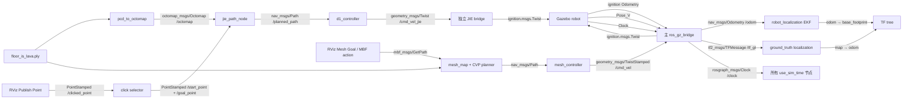

# JIE 3D Nav 与 mesh_nav 共用 Gazebo 仿真的使用与排障手册

> 适用目录：`/home/rainple/nav_test`  
> ROS 2：Humble；Gazebo：Ignition/Gazebo 6；验证日期：2026-08-07

## 1. 先说结论

当前仿真、机器人模型、里程计、TF 和 JIE 控制器本身都能工作。实际复现中，JIE 路径执行失败的主要原因在速度桥接层，而不是规划层：

1. `ros_gazebo_bridge.yaml` 同时把以下两个不同 ROS 类型映射到同一个 Gazebo 话题 `/model/robot/cmd_vel`：
   - mesh_nav 的 `/cmd_vel`：`geometry_msgs/msg/TwistStamped`
   - JIE 的 `/cmd_vel_jie`：`geometry_msgs/msg/Twist`
2. 同一个 `parameter_bridge` 进程为第二个映射创建 Gazebo publisher 时失败，启动日志已经明确给出：

   ```text
   Node::Advertise(): Error advertising topic [/model/robot/cmd_vel].
   ```

3. 因此会出现一种很迷惑的状态：
   - `/planned_path` 有非空路径；
   - `/cmd_vel_jie` 以约 20 Hz 发布非零速度；
   - `ros2 topic info` 甚至能看到 bridge 订阅者；
   - 但 Gazebo 的 `/model/robot/cmd_vel` 没收到 JIE 命令，机器人不动。

正确做法是：保留原来供 mesh_nav 使用的 `TwistStamped` 配置；JIE 的 `Twist` 使用一个独立、单向的 bridge 进程。

本次完整验证结果如下：

| 测试 | 结果 |
|---|---|
| JIE：PLY → OctoMap | 成功，8100 个源点生成 5556 个占据体素 |
| JIE：A* 规划 | 成功，从 `(0,0)` 到 `(1.5,0)` 得到 8 个路径点 |
| JIE：路径跟踪 | 成功，机器人从约 `(0,0)` 到达 `(1.453,0.096)` 后停止 |
| mesh_nav：GetPath | 成功，`outcome: 0`，得到 4 个路径点，代价约 `1.1152` |
| mesh_nav：路径执行 | 能驱动车辆到目标附近，但当前参数下终点姿态会振荡 |

另外还确认了四个相互独立的问题：

- 所有节点重启后，如果没有重新加载 PLY，`/octomap` 没有有效缓存，JIE RViz 会变空。
- JIE 执行时，规划起点必须靠近机器人的实时 TF 位姿；任意选一个远处起点只适合“看规划”，不适合“让机器人沿该路径执行”。
- RViz 报 `/goal_pose` 的 `DURABILITY_QOS_POLICY` 不兼容时，JIE 不应使用 `2D Goal Pose`；应使用 `Publish Point` 配合 `rviz_click_selector_node`。
- mesh_nav 当前 `mesh_controller` 会在已经到达目标位置后继续追逐终点朝向；默认 `ang_vel_factor: 7.0` 较激进，实测会在终点左右振荡。

## 2. 推荐的总体架构

不要让两个控制器同时驱动同一辆车。可以让两个规划器和两套地图同时存在，但一次只启动一条执行链。



TF 树必须最终连通：

```text
map ──ground_truth_localization──> odom ──EKF──> base_footprint
                                                └──robot_state_publisher──> 各车体/传感器 link
```

JIE 控制器查询的是 `map → base_footprint`。缺少其中任何一段，规划仍可能成功，但控制器无法知道机器人在哪里。

## 3. 数据类型和数据如何变化

### 3.1 公共仿真与定位链

| 数据 | Gazebo 类型 | ROS 2 类型 | 方向 | 用途 |
|---|---|---|---|---|
| `/clock` | `ignition.msgs.Clock` | `rosgraph_msgs/msg/Clock` | GZ → ROS | 给 `use_sim_time:=true` 的节点提供仿真时间 |
| `model/robot/odometry` → `/odom` | `ignition.msgs.Odometry` | `nav_msgs/msg/Odometry` | GZ → ROS | 位置、四元数、线速度、角速度及协方差 |
| `model/robot/pose_static` → `/tf_gt` | `gz.msgs.Pose_V` | `tf2_msgs/msg/TFMessage` | GZ → ROS | 仿真真值位姿，供 ground-truth 定位节点生成 `map → odom` |
| `/tf` | — | `tf2_msgs/msg/TFMessage`，内部元素是 `TransformStamped` | ROS 内部 | 把 map、odom 和机器人坐标系连接起来 |

数据并不是把 `/odom` 直接改名成 TF：EKF 读取 `nav_msgs/Odometry`，估计并发布 `odom → base_footprint`；ground-truth 定位节点读取 `/tf_gt`，结合 TF 发布 `map → odom`。

### 3.2 JIE 链

| 话题 | ROS 2 类型 | 关键字段 | QoS/说明 |
|---|---|---|---|
| `/clicked_point` | `geometry_msgs/msg/PointStamped` | `header.frame_id=map`、三维 `point` | RViz `Publish Point` 输出；通常 volatile |
| `/start_point` | `geometry_msgs/msg/PointStamped` | 起点 XYZ | reliable + transient local |
| `/goal_point` | `geometry_msgs/msg/PointStamped` | 终点 XYZ | reliable + transient local |
| `/octomap` | `octomap_msgs/msg/Octomap` | 分辨率、二进制八叉树数据、frame | reliable + transient local |
| `/planned_path` | `nav_msgs/msg/Path` | `header.frame_id` 和 `PoseStamped[] poses` | reliable + transient local；`poses: []` 表示无有效路径 |
| `/planned_path_marker` | `visualization_msgs/msg/Marker` | RViz 线条/点的显示属性 | 用于避免 Path 被体素遮住 |
| `/start_navigation` | `std_msgs/msg/Bool` | `data: true` | 允许控制器执行已经缓存的路径 |
| `/stop_navigation` | `std_msgs/msg/Bool` | `data: true` | 清空路径并输出零速度 |
| `/cmd_vel_jie` | `geometry_msgs/msg/Twist` | `linear.x`、`angular.z` | 无 header、无时间戳；适配差速底盘 |
| Gazebo `/model/robot/cmd_vel` | `ignition.msgs.Twist` | 线速度、角速度 | bridge 将 ROS `Twist` 转成 Gazebo protobuf 消息 |

JIE 的核心数据变化是：

```text
PLY 顶点
  → 0.2 m 体素化
  → octomap_msgs/Octomap
  → 机器人半径膨胀、地面支撑检查、预阻塞代价
  → A* 的三维体素索引序列
  → nav_msgs/Path（米制 map 坐标）
  → 控制器把目标点变换到 base_footprint
  → geometry_msgs/Twist
  → ignition.msgs.Twist
  → Gazebo DiffDrive
```

### 3.3 mesh_nav 链

| 接口 | 类型 | 含义 |
|---|---|---|
| `/move_base_flex/get_path` | `mbf_msgs/action/GetPath` | 输入目标 `PoseStamped`，输出 `nav_msgs/Path`、代价和结果码 |
| `/move_base_flex/exe_path` | `mbf_msgs/action/ExePath` | 输入规划路径，持续输出控制反馈 |
| `/move_base_flex/move_base` | `mbf_msgs/action/MoveBase` | 串联 GetPath 与 ExePath 的完整导航 action |
| `/move_base_flex/path` | `nav_msgs/msg/Path` | MBF 最近规划路径的可视化话题 |
| `/cmd_vel` | `geometry_msgs/msg/TwistStamped` | mesh_controller 输出；比 `Twist` 多 `Header` 和时间戳 |
| Gazebo `/model/robot/cmd_vel` | `ignition.msgs.Twist` | 主 bridge 去掉 ROS Header 后转为 Gazebo Twist |

mesh_nav 不是把 PLY 先转成 OctoMap。它保留三角网格拓扑，建立顶点、三角面和边，并生成高度差、边界、粗糙度、膨胀、动态障碍等代价层。CVP planner 在网格边及矢量场上计算路径。

## 4. 一次性配置修正

打开文件：

```text
/home/rainple/nav_test/meshnav_demo_ws/src/mesh_navigation_tutorials/
mesh_navigation_tutorials_sim/config/ros_gazebo_bridge.yaml
```

保留 mesh_nav 原有配置：

```yaml
- ros_topic_name: "/cmd_vel"
  ros_type_name: "geometry_msgs/msg/TwistStamped"
  gz_topic_name: "/model/robot/cmd_vel"
  gz_type_name: "ignition.msgs.Twist"
  direction: ROS_TO_GZ
```

删除或注释文件末尾后来加入的这一块：

```yaml
- ros_topic_name: "/cmd_vel_jie"
  gz_topic_name: "/model/robot/cmd_vel"
  ros_type_name: "geometry_msgs/msg/Twist"
  gz_type_name: "ignition.msgs.Twist"
  direction: ROS_TO_GZ
```

JIE 速度改用后文的独立 bridge。原因不是 `Twist` 类型本身不受支持，而是同一 bridge 进程正在尝试用两个 ROS 类型重复 advertise 同一个 Gazebo 话题。

修改源码配置后必须重新构建，或者至少确保安装空间是符号链接构建；否则 launch 仍可能读取 `install/` 里的旧副本。

## 5. 构建和环境

只需在源码变化后执行一次：

```bash
cd /home/rainple/nav_test/meshnav_demo_ws
source /opt/ros/humble/setup.bash
colcon build --symlink-install \
  --base-paths src ../jie_3d_nav \
  --cmake-args -DCMAKE_BUILD_TYPE=Release
source install/setup.bash
```

各部分含义：

- `cd .../meshnav_demo_ws`：把这个工作空间作为统一 build/install/log 目录。
- `source /opt/ros/humble/setup.bash`：加载 ROS 2 Humble 的命令、系统消息和依赖。
- `colcon build`：构建两个源码集合。
- `--base-paths src ../jie_3d_nav`：只扫描仿真工作空间的 `src` 与 JIE 源码，避免同时扫描顶层另一份 `mesh_navigation` 而产生同名包冲突。
- `--symlink-install`：Python、launch、yaml 等文件尽量通过符号链接安装，修改后不容易继续读取旧副本；C++ 改动仍要重编译。
- `Release`：降低 mesh 地图计算和 A* 的运行开销。
- 最后一条 `source`：把本次构建出的包叠加到当前终端环境。

每打开一个新终端都要执行：

```bash
source /opt/ros/humble/setup.bash
source /home/rainple/nav_test/meshnav_demo_ws/install/setup.bash
```

如果忘记 source，典型现象是 `Package not found`、`No executable found`，或者误用另一个工作空间里的旧可执行文件。

## 6. 启动公共 Gazebo、定位和 mesh_nav

### 终端 1：启动完整仿真

```bash
source /opt/ros/humble/setup.bash
source /home/rainple/nav_test/meshnav_demo_ws/install/setup.bash

ros2 launch mesh_navigation_tutorials \
  mesh_navigation_tutorials_launch.py \
  world_name:=floor_is_lava \
  map_name:=floor_is_lava \
  localization:=ground_truth \
  start_gazebo_gui:=True \
  start_rviz:=False
```

参数含义：

- `world_name` 选择 Gazebo 的 `floor_is_lava.sdf`。
- `map_name` 选择与世界配套的 `floor_is_lava.ply`。世界与地图必须成对，否则视觉障碍与规划障碍不重合。
- `localization:=ground_truth` 使用 Gazebo 真值定位，排除定位算法误差，适合比较规划器。
- `start_gazebo_gui` 控制 Gazebo 图形界面；无显示环境时可改为 `False`。
- `start_rviz:=False` 暂时不让此 launch 自动开 mesh RViz，避免和 JIE RViz 混在一起。测试 mesh_nav 时再单独打开。

这个 launch 会启动 Gazebo、机器人、主 bridge、`robot_state_publisher`、EKF、ground-truth localization 和 MBF mesh server。

等待日志出现 mesh 地图顶点/面加载成功后再继续。初次生成 `floor_is_lava.h5` 可能较慢。

### 终端 2：公共链路健康检查

```bash
source /opt/ros/humble/setup.bash
source /home/rainple/nav_test/meshnav_demo_ws/install/setup.bash

ros2 topic echo /clock --once
ros2 topic echo /odom --once
ros2 run tf2_ros tf2_echo map base_footprint
```

如何判断：

- `/clock` 必须有数据，并且时间持续增长；否则所有 `use_sim_time` 定时器都会像“卡死”。
- `/odom` 必须有 `frame_id: odom`、`child_frame_id: base_footprint`。
- `tf2_echo` 第一次可能先显示一次 `Invalid frame ID`，等待发现后应持续打印变换；这一次启动时的短暂提示不等于长期 TF 故障。
- 终止持续输出的 `tf2_echo` 使用 `Ctrl-C`。

## 7. 用同一仿真测试 JIE 全局规划器并驱动车辆

### 7.1 终端 3：把配套 PLY 转成 OctoMap

```bash
source /opt/ros/humble/setup.bash
source /home/rainple/nav_test/meshnav_demo_ws/install/setup.bash

ros2 run jie_octomap pcd_to_octomap_node --ros-args \
  -p pcd_file:=/home/rainple/nav_test/meshnav_demo_ws/src/mesh_navigation_tutorials/mesh_navigation_tutorials/maps/floor_is_lava.ply \
  -p frame_id:=map \
  -p octomap_topic:=/octomap \
  -p resolution:=0.2 \
  -p voxel_downsample_m:=0.0 \
  -p min_points_per_voxel:=1 \
  -p min_cluster_voxels:=1 \
  -p use_sim_time:=true
```

命令说明：

- `ros2 run <包> <可执行文件>` 启动单个节点。
- `--ros-args` 表示后面是 ROS 参数或重映射参数。
- `-p name:=value` 设置节点参数。
- `pcd_file` 虽然参数名叫 PCD，但该节点通过 Open3D 读取点云，当前 PLY 顶点可以正常读取。
- `resolution:=0.2` 把空间划分为边长 0.2 m 的体素；分辨率越小，地图更细但搜索量更大。
- `voxel_downsample_m:=0.0` 关闭额外下采样，避免再损失稀疏 PLY 顶点。
- 两个最小值设为 1，保留单点体素和小连通簇，避免地图被过滤空。
- `use_sim_time:=true` 让消息时间戳和 Gazebo `/clock` 一致。

本地图的正常日志应接近：

```text
source_points=8100
counted_voxels=4062
occupied_voxels=5556
```

`pcd_to_octomap_node` 发布的是 `octomap_msgs/Octomap`，而当前 JIE RViz 的“Octomap Voxels”显示项实际订阅的是可视化 Marker `/octomap_occupied_markers`，两者不是同一个话题。必须在另一个终端启动转换显示节点：

```bash
source /opt/ros/humble/setup.bash
source /home/rainple/nav_test/meshnav_demo_ws/install/setup.bash

ros2 run jie_octomap octomap_to_occupied_markers_node --ros-args \
  -p use_sim_time:=true \
  -p octomap_topic:=/octomap \
  -p marker_topic:=/octomap_occupied_markers \
  -p frame_id:=map
```

颜色含义：橙色是 PLY 生成的原始占据体素，蓝色是规划器生成的预阻塞单元。若只看到蓝色轮廓，通常不是底层 OctoMap 丢失，而是这个 Marker 转换节点没有启动。还可以在 RViz 中 Add → Marker，订阅 `/traversable_cells_markers`，用绿色显示规划器实际判定的可通行单元。

注意：不要对这个 tutorial world 使用当前的 `world_to_octomap_node`。该 SDF 主要通过 `<include><uri>model://...` 引入模型，碰撞几何又是 mesh；现有 world importer 只处理 world 中直接声明的 model 和 box/cylinder/sphere/plane 等基本体，可能得到 `shapes=0` 的空地图。

### 7.2 终端 4：启动 JIE A* 规划器

```bash
source /opt/ros/humble/setup.bash
source /home/rainple/nav_test/meshnav_demo_ws/install/setup.bash

ros2 run octo_planner jie_path_node --ros-args \
  -p use_sim_time:=true \
  -p frame_id:=map \
  -p octomap_topic:=/octomap \
  -p start_topic:=/start_point \
  -p goal_topic:=/goal_point \
  -p path_topic:=/planned_path \
  -p robot_radius:=0.2 \
  -p max_iterations:=500000 \
  -p snap_search_radius_cells:=12 \
  -p require_ground_support:=true \
  -p strict_direct_ground_support:=false \
  -p ground_support_xy_radius_cells:=1 \
  -p ground_support_depth_cells:=1 \
  -p enable_preblocked_costmap:=true \
  -p preblocked_costmap_radius_cells:=3 \
  -p preblocked_costmap_weight:=2.5
```

关键参数解释：

- `robot_radius` 用于障碍膨胀。该窄通道地图用 `0.4` 很容易把通路完全封死，实测 `0.2` 可规划；正式实验应按机器人真实外接圆半径设置。
- `max_iterations` 是 A* 最大扩展次数，防止无路时无限计算。
- `snap_search_radius_cells` 允许把鼠标点击点吸附到附近可通行体素。
- `require_ground_support` 防止规划路径悬空。
- `strict_direct_ground_support:=false` 与邻域/深度参数允许地面体素有少量离散误差。
- preblocked costmap 在靠近障碍处增加代价，使路径倾向远离墙体。

节点收到地图后应打印预阻塞单元统计。每次地图更新时规划器可能先发布一次空 Path，这是清理旧路径，不代表后续一定规划失败。

### 7.3 终端 5：启动点击选择器

```bash
source /opt/ros/humble/setup.bash
source /home/rainple/nav_test/meshnav_demo_ws/install/setup.bash

ros2 run jie_octomap rviz_click_selector_node --ros-args \
  -p use_sim_time:=true \
  -p clicked_topic:=/clicked_point \
  -p start_topic:=/start_point \
  -p goal_topic:=/goal_point
```

选择器把 RViz 的连续点击交替解释为：第 1 次是绿色 START，第 2 次是红色 GOAL，第 3 次又是 START，以此循环。它还把 volatile 的 `/clicked_point` 转成 reliable + transient-local 的 `/start_point` 和 `/goal_point`，使晚启动的规划器也能取得最近一次选择。

### 7.4 终端 6：启动 JIE 控制器，但先保持安全门关闭

```bash
source /opt/ros/humble/setup.bash
source /home/rainple/nav_test/meshnav_demo_ws/install/setup.bash

ros2 run octo_planner d1_controller --ros-args \
  -p use_sim_time:=true \
  -p path_topic:=/planned_path \
  -p cmd_vel_topic:=/cmd_vel_jie \
  -p map_frame:=map \
  -p base_frame:=base_footprint \
  -p require_start_command:=true \
  -p enable_lateral_motion:=false \
  -p align_final_yaw:=false \
  -p enable_tracking_debug_view:=false \
  -p max_linear_speed:=0.25 \
  -p max_angular_speed:=0.8 \
  -p lookahead_distance:=0.45 \
  -p tracking_point_reached_xy_tolerance:=0.20 \
  -p goal_position_tolerance:=0.15 \
  -p robot_center_offset_frame:=base_footprint \
  -p robot_center_offset_x:=0.0 \
  -p robot_center_offset_y:=0.0 \
  -p robot_center_offset_z:=0.0
```

为什么这样设置：

- `require_start_command:=true`：收到路径后只缓存，不立刻开车；检查路径无误后再授权。
- `enable_lateral_motion:=false`：仿真机器人是差速底盘，不能直接执行 `linear.y` 横移。
- `base_frame:=base_footprint`：与公共 TF 树一致。
- 偏移全部清零：原 JIE 参数中的实体 D1 几何偏移不适用于这个 Ceres 仿真模型。
- `enable_tracking_debug_view:=false`：关闭 OpenCV 调试窗口，避免在无图形显示的终端中报错；RViz Marker 不受影响。
- `align_final_yaw:=false`：JIE 的 PointStamped 交互没有提供可靠终点朝向，先验证位置到达。
- 速度先限制到 0.25 m/s，便于观察和急停。

控制器收到非空路径后应打印：

```text
Received planned_path with N poses. Waiting for /start_navigation confirmation.
```

### 7.5 终端 7：启动 JIE 独立单向速度 bridge

```bash
source /opt/ros/humble/setup.bash
source /home/rainple/nav_test/meshnav_demo_ws/install/setup.bash

ros2 run ros_gz_bridge parameter_bridge \
  '/model/robot/cmd_vel@geometry_msgs/msg/Twist]ignition.msgs.Twist' \
  --ros-args \
  -r /model/robot/cmd_vel:=/cmd_vel_jie \
  -r __node:=jie_cmd_bridge
```

这是整个修复的关键：

- bridge 表达式中的 `]` 表示只创建 ROS → Gazebo 方向。
- 左侧是 Gazebo 原始话题名，ROS 类型是 `geometry_msgs/msg/Twist`，Gazebo 类型是 `ignition.msgs.Twist`。
- `-r old:=new` 把 bridge 在 ROS 侧的 `/model/robot/cmd_vel` 重映射成控制器实际发布的 `/cmd_vel_jie`。
- 整个 bridge 表达式必须用单引号包住，否则 `]` 等字符可能被 shell 错误解释。
- 独立进程只 advertise 一次 Gazebo cmd_vel，不再与主 bridge 内的 `TwistStamped` 配置冲突。

正确启动日志只有 ROS → GZ 一条：

```text
Creating ROS->GZ Bridge: ... Twist -> ... ignition.msgs.Twist
```

### 7.6 终端 8：启动 JIE RViz

```bash
source /opt/ros/humble/setup.bash
source /home/rainple/nav_test/meshnav_demo_ws/install/setup.bash

rviz2 \
  -d /home/rainple/nav_test/jie_3d_nav/jie_octomap/rviz/octomap_test.rviz \
  --ros-args \
  -r __node:=jie_rviz \
  -r /goal_pose:=/jie_unused_goal_pose \
  -p use_sim_time:=true
```

RViz 设置：

1. `Fixed Frame` 必须是 `map`。
2. 使用工具栏的 `Publish Point`，不要用 `2D Goal Pose`。
3. 第一次点击当前机器人附近作为起点，第二次点击目标。
4. 如路径被蓝色/橙色体素遮住，新增 `Marker` 显示 `/planned_path_marker`，或者暂时关闭体素显示。
5. 路径显示应订阅 `/planned_path`，类型是 `nav_msgs/Path`。

这里把 RViz 的 `/goal_pose` 重映射到未使用的话题，是因为 JIE 采用 `/clicked_point → /start_point、/goal_point`；当前规划器对 `/goal_pose` 请求 transient-local，而 RViz 2D Goal 工具提供 volatile，两者会产生重复的 durability 警告。重映射不会影响 `Publish Point`。如果以后需要直接使用 2D Goal，应把 `jie_path_node.cpp` 中 `goal_pose_sub_` 改为 reliable + volatile QoS，而不是继续使用该重映射。

执行导航时，起点不要凭视觉随意放在远处。先用下面命令读取机器人实际 XY，然后在它附近点击：

```bash
ros2 run tf2_ros tf2_echo map base_footprint
```

### 7.7 在开车前检查路径，然后授权执行

检查 Path 是否非空：

```bash
ros2 topic echo /planned_path --once \
  --qos-reliability reliable \
  --qos-durability transient_local
```

必须看到：

```yaml
header:
  frame_id: map
poses:
- ...
- ...
```

如果是 `poses: []`，不要发送启动命令。

确认路径后启动：

```bash
ros2 topic pub --once \
  /start_navigation std_msgs/msg/Bool \
  "{data: true}"
```

含义是只发布一次布尔许可。控制器将缓存 Path 转换成连续的速度命令。车辆先转一个角度再前进通常是正常的：控制器需要先减小当前朝向与路径切线的误差。

随时急停：

```bash
ros2 topic pub --once \
  /stop_navigation std_msgs/msg/Bool \
  "{data: true}"
```

`stop_navigation` 会让 JIE 清除当前路径并连续发布一小段零速度。单纯 `Ctrl-C` 关闭 RViz 不会停止控制器。

## 8. 用同一仿真测试 mesh_nav

终端 1 的完整 launch 已经启动 mesh server 和主 `TwistStamped` bridge。测试 mesh_nav 前：

1. 确保 JIE 已停止；最好关闭 `d1_controller` 和独立 `jie_cmd_bridge`。
2. 不要让 `/cmd_vel` 与 `/cmd_vel_jie` 同时有非零命令。

### 8.1 只测试全局规划器（推荐用于公平对比）

```bash
source /opt/ros/humble/setup.bash
source /home/rainple/nav_test/meshnav_demo_ws/install/setup.bash

ros2 action send_goal \
  /move_base_flex/get_path \
  mbf_msgs/action/GetPath \
  "{use_start_pose: false, target_pose: {header: {frame_id: map}, pose: {position: {x: 2.5, y: 0.0, z: 0.0}, orientation: {w: 1.0}}}, tolerance: 0.2, planner: mesh_planner, concurrency_slot: 0}"
```

字段解释：

- `use_start_pose: false`：忽略 action 里的空 `start_pose`，从实时 `map → base_footprint` 位姿开始规划。
- `target_pose`：目标是带位置和四元数的 `PoseStamped`；`w: 1.0` 表示零旋转。
- `tolerance: 0.2`：目标附近允许 0.2 m 松弛。
- `planner: mesh_planner`：显式指定配置中的 CVP 插件实例名。
- `concurrency_slot: 0`：使用默认执行槽。

成功判据：

```text
Goal accepted
outcome: 0
path:
  poses:
  - ...
cost: ...
Goal finished with status: SUCCEEDED
```

该命令只规划、不驱动车辆，最适合比较 JIE A* 与 mesh CVP 的成功率、规划耗时、路径长度和代价。

### 8.2 通过 mesh RViz 自动规划并执行

```bash
source /opt/ros/humble/setup.bash
source /home/rainple/nav_test/meshnav_demo_ws/install/setup.bash

rviz2 \
  -d /home/rainple/nav_test/meshnav_demo_ws/src/mesh_navigation_tutorials/mesh_navigation_tutorials/rviz/default.rviz \
  --ros-args \
  -r __node:=mesh_rviz \
  -p use_sim_time:=true
```

等待左侧 `MbfGoalActions` 面板中的 Planner 和 Controller 都显示 ready。使用工具栏的 `Mesh Goal`，在网格面上点击并拖动朝向：

```text
Mesh Goal
  → geometry_msgs/PoseStamped /rviz/goal_pose
  → MbfGoalActions 自动调用 GetPath
  → 成功后自动把返回的 nav_msgs/Path 交给 ExePath
  → mesh_controller 发布 TwistStamped /cmd_vel
  → 主 ros_gz_bridge 转为 ignition.msgs.Twist
```

也可以直接调用完整 action：

```bash
ros2 action send_goal \
  /move_base_flex/move_base \
  mbf_msgs/action/MoveBase \
  "{target_pose: {header: {frame_id: map}, pose: {position: {x: 2.5, y: 0.0, z: 0.0}, orientation: {w: 1.0}}}, controller: mesh_controller, planner: mesh_planner, recovery_behaviors: []}"
```

不要为长期命令外套 `timeout`。`timeout` 杀死 action CLI 客户端后，服务端目标仍可能继续执行，机器人会继续运动。

### 8.3 mesh_controller 终点振荡的处理

本次测试中，mesh_nav 把机器人从约 `(1.453,0.096)` 驶到 `(2.552,-0.034)`，但在位置已经进入 0.2 m 容差后，终点朝向误差仍约 2.17 rad，控制器持续输出约 `±0.475 rad/s`，所以看起来“到点后一直左右转”。

先把参数调保守：

```bash
ros2 param set /move_base_flex mesh_controller.max_lin_velocity 0.35
ros2 param set /move_base_flex mesh_controller.max_ang_velocity 0.35
ros2 param set /move_base_flex mesh_controller.lin_vel_factor 0.5
ros2 param set /move_base_flex mesh_controller.ang_vel_factor 1.0
```

如果当前实验只要求比较全局路径并验证到达位置，可在下面的配置文件中把 `angle_tolerance: 0.8` 临时改成 `angle_tolerance: 3.14`，然后重启公共 launch：

```text
/home/rainple/nav_test/meshnav_demo_ws/src/mesh_navigation_tutorials/
mesh_navigation_tutorials/config/mbf_mesh_nav.yaml
```

不要只执行 `ros2 param set /move_base_flex angle_tolerance 3.14`：当前 `AbstractControllerExecution::reconfigure()` 没有把运行时该参数写回内部的 `angle_tolerance_`，因此参数服务可能返回成功，但当前控制线程仍使用启动时的旧值。修改 YAML 并重启才能确定生效。

这不是全局规划器问题，而是当前局部控制器/终点判定问题。正式修复时还应检查 `mesh_controller.cpp`：角速度目前使用 `std::min(max, command)`，只限制正方向，推荐改为对称的 `std::clamp(command, -max, max)`；同时应在进入 `dist_tolerance` 后单独跟踪目标四元数，而不是继续追逐目标附近可能不连续的 mesh vector field。

取消所有当前 mesh `move_base` 目标：

```bash
ros2 service call \
  /move_base_flex/move_base/_action/cancel_goal \
  action_msgs/srv/CancelGoal \
  "{goal_info: {goal_id: {uuid: [0, 0, 0, 0, 0, 0, 0, 0, 0, 0, 0, 0, 0, 0, 0, 0]}, stamp: {sec: 0, nanosec: 0}}}"
```

全零 UUID 和零时间戳表示取消该 action server 上的所有目标。配置中的 `force_stop_on_cancel: true` 会要求 MBF 输出零速度。

## 9. 从上到下的一次性排障清单

严格按顺序检查。上一层没有通过，不要跳到下一层调控制器参数。

### 9.1 进程和 ROS 图

```bash
ros2 node list
```

JIE 完整链至少应包含：

```text
/pcd_to_octomap
/jie_path_node
/rviz_click_selector
/d1_controller
/jie_cmd_bridge
/ekf_filter_node
/ground_truth_localization_node
/robot_state_publisher
/ros_gz_bridge
```

若出现多个同名 `/rviz`，关闭多余实例或用 `-r __node:=jie_rviz`、`mesh_rviz` 分开命名。

### 9.2 仿真时钟

```bash
ros2 topic hz /clock
ros2 param get /jie_path_node use_sim_time
ros2 param get /d1_controller use_sim_time
```

在 Gazebo 测试中均应为 `true`。时钟不统一会导致 TF extrapolation、Marker 过期或定时控制不运行。

### 9.3 地图不是“有 publisher”，而是“真的有数据”

```bash
ros2 topic info -v /octomap
ros2 topic echo /octomap --once \
  --qos-reliability reliable \
  --qos-durability transient_local
```

只看 publisher 数量不够。必须能 echo 到 `id`、`resolution` 和非空 `data`。

所有节点重启后，transient-local 缓存也随发布节点消失。必须重新启动带 `pcd_file` 参数的 importer，或向已经运行的 importer 重新发文件：

```bash
ros2 topic pub --once \
  /pcd_file_cmd std_msgs/msg/String \
  "{data: '/home/rainple/nav_test/meshnav_demo_ws/src/mesh_navigation_tutorials/mesh_navigation_tutorials/maps/floor_is_lava.ply'}"
```

### 9.4 点击点和 QoS

```bash
ros2 topic echo /clicked_point --once
ros2 topic echo /start_point --once --qos-durability transient_local
ros2 topic echo /goal_point --once --qos-durability transient_local
```

RViz 的警告：

```text
New subscription discovered on topic '/goal_pose' ...
Last incompatible policy: DURABILITY_QOS_POLICY
```

表示 RViz 的 `2D Goal Pose` publisher 与 JIE 的 transient-local `/goal_pose` subscriber 不兼容。它不会让 `/octomap` 或 `/planned_path` 消失。JIE 改用 `Publish Point` 即可；mesh RViz 则使用其专用 `Mesh Goal` 和 MBF panel。

### 9.5 路径

```bash
ros2 topic echo /planned_path --once \
  --qos-reliability reliable \
  --qos-durability transient_local
```

常见结果：

- 有多个 `poses`：规划成功。
- `poses: []`：地图刚更新清理旧路径，或本次规划失败。
- 一直等不到：规划器没发布、话题名不一致，或者 QoS 不匹配。
- RViz 看不到但 echo 非空：显示问题；检查 Fixed Frame、Path Topic、Alpha、Z 偏移，或使用 `/planned_path_marker`。

### 9.6 TF 和起点一致性

```bash
ros2 run tf2_ros tf2_echo map base_footprint
```

必须连续更新。执行路径时 `/start_point` 与机器人 TF 的 XY 应相近。JIE 控制器会从路径中寻找离机器人最近的点；若路径整体远离机器人，它可能原地转、倒车去找路径，或迅速判定无法跟踪。

### 9.7 JIE 安全门和速度

```bash
ros2 param get /d1_controller require_start_command
ros2 topic hz /cmd_vel_jie
ros2 topic echo /cmd_vel_jie --once
```

- `require_start_command=true` 且未发送 `/start_navigation` 时，等待是正常行为。
- 开始后应约 20 Hz 发布。
- 只转不走时看 `linear.x`：如果是 0 而 `angular.z` 非零，控制器正在对齐；持续很久则检查路径起点和 TF。
- `Twist` 有数据只证明控制器层成功，不证明 Gazebo 收到了。

### 9.8 bridge 必须看到“Passing message”

```bash
ros2 topic info -v /cmd_vel_jie
ign topic -e -t /model/robot/cmd_vel
```

独立 bridge 首次转发时应打印：

```text
Passing message from ROS geometry_msgs/msg/Twist to Gazebo gz.msgs.Twist
```

如果 ROS 有非零速度而 `ign topic` 没有消息，故障就在 bridge。重点找启动日志里的 `Error advertising topic`，不要继续调 PID、速度增益或 TF。

### 9.9 Gazebo 反馈

```bash
ros2 topic echo /odom --once
ros2 run tf2_ros tf2_echo map base_footprint
```

发送非零速度后，`/odom.pose.pose.position` 和 TF translation 应改变。如果 Gazebo cmd_vel 有数据但两者不变，再检查：

- Gazebo 是否暂停；
- robot DiffDrive 插件是否加载；
- 话题是否确实是 `/model/robot/cmd_vel`；
- 车轮碰撞、关节和地面接触是否正常。

## 10. 症状—原因—处理对照表

| 症状 | 最可能原因 | 立即检查/处理 |
|---|---|---|
| 重启后 RViz 全空 | PLY 没重新加载，transient 缓存随节点消失 | echo `/octomap`，重启 importer 或发 `/pcd_file_cmd` |
| 有起终点箭头，无路径 | 空地图、点不可通行、半径膨胀过大 | 查 planner 日志、`poses: []`；把本图测试半径先设 0.2 |
| 路径可能存在但看不见 | 被体素遮挡、Fixed Frame/Topic 错 | 显示 `/planned_path_marker`，Fixed Frame=`map` |
| `/goal_pose` QoS 警告 | RViz volatile 与 JIE transient-local 不兼容 | JIE 使用 Publish Point + click selector |
| 控制器提示等待 | `require_start_command=true` | 检查路径后发布 `/start_navigation true` |
| 只转一个角度后停住 | 临时 bridge 被 `timeout` 杀死，或控制器只有角速度 | bridge 不要用 timeout；同时检查 `/cmd_vel_jie` 与 Gazebo cmd_vel |
| `/cmd_vel_jie` 非零但车不动 | 重复 Gazebo cmd_vel bridge advertise 失败 | 删除 YAML 中 JIE 条目，启动独立单向 bridge |
| 规划路径起点在远处，车行为怪异 | 交互起点与实时机器人位姿不一致 | 用 TF 读当前位置，重新选起点 |
| TF 一直不存在 | EKF、ground-truth localization 或 `/tf_gt` 缺失 | 逐段查 `map→odom`、`odom→base_footprint` |
| mesh GetPath 失败，`OUT_OF_MAP` | 目标不在 mesh 表面或地图/世界不配套 | 用 Mesh Goal 在表面选点，确认 map_name=world_name |
| mesh 到点附近一直左右转 | 终点姿态/矢量场和高角速度增益导致振荡 | 取消 action；降低增益，或全局规划实验把 angle tolerance 设 3.14 |
| mesh 启动有 SimplePlanner FATAL，但 action 存在 | mesh server 基类先尝试 simple plugin，后续 mesh 专用 loader 成功 | 以 action list 和 GetPath `outcome` 为准；本次 GetPath 已实测成功 |
| 关闭 mesh launch 时 class_loader 异常 | 插件对象卸载顺序问题 | 运行中通常不影响 GetPath；这是退出清理缺陷，记录但不要误判为启动失败 |

## 11. 公平比较两个全局规划器

如果目标是比较“全局规划器”，不要把局部控制器的好坏混进结果。建议每组实验：

1. 固定同一个 `floor_is_lava` world 和同一个 PLY。
2. 每次重置 Gazebo，使机器人初始 TF 相同。
3. 使用相同的 map 坐标起终点；JIE 的起终点是 `PointStamped`，mesh 的是 `PoseStamped`，比较位置时统一取 XYZ。
4. JIE 只记录 `/planned_path`；mesh 只调用 `/get_path`，不执行 `/move_base`。
5. 路径长度按相邻 `PoseStamped.position` 的欧氏距离求和。
6. 记录：规划成功率、规划耗时、路径长度、最小障碍距离、节点/体素或网格规模、CPU 和内存。
7. JIE 路径点位于 0.2 m 体素中心，mesh 路径点位于三角网格表面；比较 XY 路径或把两者都投影到同一表面，避免仅由 Z 基准差异造成偏差。
8. JIE `preblocked_costmap_weight` 与 mesh `edge_cost_factor` 都会改变“最短”和“更安全”的权衡；比较最短路径时应把两边附加代价关掉或明确记录。

不要直接比较 `/planned_path` 的 pose 数量：JIE 的采样间距主要由 OctoMap resolution 决定，mesh 的路径点由网格和回溯简化决定，点数不是路径质量。

## 12. 结束与清理

推荐停止顺序：

1. JIE 正在执行时先发 `/stop_navigation true`。
2. mesh 正在执行时先取消 action。
3. 再分别在控制器、bridge、规划器、地图和 RViz 终端按 `Ctrl-C`。
4. 最后在公共 launch 终端按 `Ctrl-C` 关闭 Gazebo。

确认没有残留：

```bash
ros2 node list
```

若下一次启动出现多个同名节点或速度发布者，先关闭残留进程，不要让两套控制器同时连接底盘。

## 13. 最短的已验证 JIE 闭环测试值

当需要先排除复杂地图点选问题时，可在 `floor_is_lava` 初始位姿直接发布这组已验证坐标：

```bash
ros2 topic pub --once \
  --qos-reliability reliable \
  --qos-durability transient_local \
  /start_point geometry_msgs/msg/PointStamped \
  "{header: {frame_id: map}, point: {x: 0.0, y: 0.0, z: 0.0}}"

ros2 topic pub --once \
  --qos-reliability reliable \
  --qos-durability transient_local \
  /goal_point geometry_msgs/msg/PointStamped \
  "{header: {frame_id: map}, point: {x: 1.5, y: 0.0, z: 0.0}}"
```

正常结果是 8 个 pose，位置大致从 `(0.1,0.1,0.1)` 到 `(1.5,0.1,0.1)`。检查非空后再发 `/start_navigation true`。本次实测最终 TF 为约 `(1.453,0.096,-0.120)`，随后控制器打印到达并停止。
