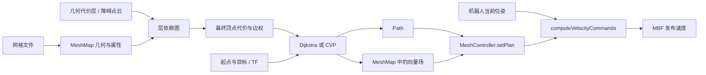
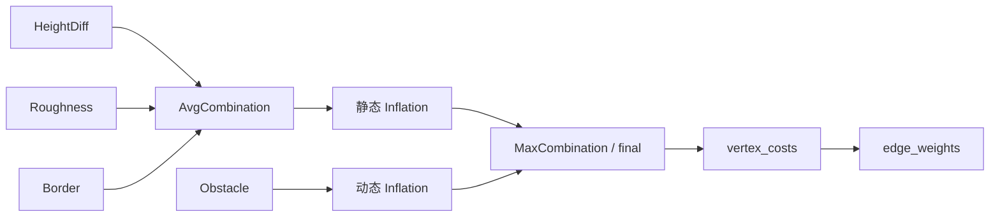
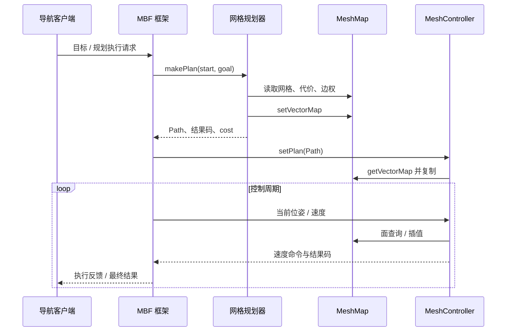

# Mesh Navigation 源码阅读指南：从三角网格到机器人速度

> 阅读基准：naturerobots/mesh_navigation，`main` 在本次核对时的提交 **2fd7ada704a48d4b463746cad1268fe9f9ea2220**。核对日期：2026-09-22。
> 正文讲解原始项目；末尾附录说明本仓库的模拟器适配。本文是源码静态阅读，不代表已重新运行仿真或验证所有算法边界。

## 1. 先建立整体认识

MeshNav 在三维空间中的三角曲面上规划地面机器人的运动。曲面具有三维坐标，但机器人沿曲面运动，局部仍是二维问题。斜坡、起伏路面、不同高度的通道可以用不同三角面表达。

它不负责从原始点云完成整个建图过程，也不在本仓库实现定位系统，更不直接计算轮子力矩。它接收网格地图、定位/TF、目标，以及可选的障碍点云，输出路径和底盘速度。曲面拓扑决定哪些地方连通，代价层决定哪些地方危险，规划器生成通往目标的方向场，控制器把方向场变成速度。

先记住这条链：



**关键认识：Path 并不是原版 MeshController 的全部输入。** 规划器还把向量场写入共享的 `MeshMap`；控制器在 `setPlan()` 中复制它。仅向执行路径接口提供一条任意 Path，不一定就能使用这个控制器正常跟踪。

## 2. 包结构与阅读顺序

| 包 / 目录 | 职责 | 第一遍关注点 |
|---|---|---|
| `mesh_navigation` | 聚合依赖的元包 | 不必在这里寻找规划算法 |
| `mbf_mesh_core` | 网格规划、控制、恢复插件的接口 | `initialize()` 如何获得共享地图 |
| `mbf_mesh_nav` | 将网格插件接入 Move Base Flex | 程序入口、服务器、执行包装 |
| `mesh_map` | 网格几何、属性、查询、层管理 | `readMap()`、`LayerManager`、插值 |
| `mesh_layers` | 地形与障碍代价计算 | 静态层、组合层、膨胀层、动态层 |
| `dijkstra_mesh_planner` | 在顶点—边图上搜索 | 势值、松弛、前驱、路径回溯 |
| `cvp_mesh_planner` | 三角面上的连续向量场规划 | 三角更新、方向重建、积分取路径 |
| `mesh_controller` | 跟随向量场生成速度 | 找面、方向插值、控制律、到达判断 |

建议按以下六轮阅读，每轮回答一个问题：

1. **入口与接口**：一次导航由谁组织？阅读 `mbf_mesh_nav.cpp`、`mesh_navigation_server.cpp` 和 `mbf_mesh_core` 头文件。
2. **地图与代价**：规划器看到的“地图”究竟是什么？阅读 `MeshMap::readMap()`、层接口和层管理器。
3. **Dijkstra**：在网格上如何完成最基础的搜索？先看它，再看 CVP。
4. **CVP**：怎样摆脱“路径只能沿网格边走”的限制？追踪一个三角面的更新。
5. **控制器**：势场方向如何变成 `linear.x` 和 `angular.z`？
6. **更新与失败**：点云改变代价以后，哪些数据更新，哪些数据需要重新规划才能更新？

依赖边界见 [source_dependencies.yaml](https://github.com/naturerobots/mesh_navigation/blob/2fd7ada704a48d4b463746cad1268fe9f9ea2220/source_dependencies.yaml)：LVR2 提供网格结构、几何计算与 IO；mesh_tools 提供相关消息、转换和可视化能力；Move Base Flex 提供通用导航执行框架。依赖分支在该文件中没有固定为提交，因此只固定 MeshNav 提交并不等于固定整个可运行系统。

## 3. 从 main 追到插件：启动时发生什么

阅读入口：[mbf_mesh_nav.cpp](https://github.com/naturerobots/mesh_navigation/blob/2fd7ada704a48d4b463746cad1268fe9f9ea2220/mbf_mesh_nav/src/mbf_mesh_nav.cpp)、[mesh_navigation_server.cpp](https://github.com/naturerobots/mesh_navigation/blob/2fd7ada704a48d4b463746cad1268fe9f9ea2220/mbf_mesh_nav/src/mesh_navigation_server.cpp)。

原版 `main()` 的顺序是：初始化 ROS → 创建节点 → 创建 TF buffer/listener → 构造 `MeshNavigationServer` → 创建多线程 executor → spin。

`MeshNavigationServer` 继承 `SimpleNavigationServer`，核心工作包括：

1. 创建 planner/controller/recovery 的 pluginlib loader。
2. 创建一份共享 `MeshMap`。
3. 调用 `readMap()` 读取几何并初始化层。
4. 调用 `initializeServerComponents()`，接入插件和服务器组件。

插件有三个不同概念，不要混淆：

| 概念 | 例子 | 用途 |
|---|---|---|
| 配置实例名 | `mesh_planner` | 参数前缀、选择具体插件实例 |
| pluginlib 类型名 | `cvp_mesh_planner/CVPMeshPlanner` | 在插件 XML 中定位实现 |
| C++ 类型 | `cvp_mesh_planner::CVPMeshPlanner` | 实际类定义 |

顺着 `loadPlannerPlugin()` 看 `createSharedInstance()`，再跟进 `initializePlannerPlugin()`。它把基类指针转换为网格插件接口，并把 `mesh_ptr_` 传进去。控制器也得到同一张地图以及 TF。

接口入口：[MeshPlanner](https://github.com/naturerobots/mesh_navigation/blob/2fd7ada704a48d4b463746cad1268fe9f9ea2220/mbf_mesh_core/include/mbf_mesh_core/mesh_planner.h)、[MeshController](https://github.com/naturerobots/mesh_navigation/blob/2fd7ada704a48d4b463746cad1268fe9f9ea2220/mbf_mesh_core/include/mbf_mesh_core/mesh_controller.h)、[MeshRecovery](https://github.com/naturerobots/mesh_navigation/blob/2fd7ada704a48d4b463746cad1268fe9f9ea2220/mbf_mesh_core/include/mbf_mesh_core/mesh_recovery.h)。

注意两层同名的 `MeshController`：`mbf_mesh_core` 中的是接口，`mesh_controller` 包中的是具体向量场控制器。

执行包装入口：[mesh_planner_execution.cpp](https://github.com/naturerobots/mesh_navigation/blob/2fd7ada704a48d4b463746cad1268fe9f9ea2220/mbf_mesh_nav/src/mesh_planner_execution.cpp)、[mesh_controller_execution.cpp](https://github.com/naturerobots/mesh_navigation/blob/2fd7ada704a48d4b463746cad1268fe9f9ea2220/mbf_mesh_nav/src/mesh_controller_execution.cpp)。包装层将调用交给插件；通用 action 生命周期、执行循环和速度发布需要继续到 Move Base Flex 阅读。不能把这些行为都归到 `MeshNavigationServer` 这个文件中。

**源码边界提示：** `planner_lock_mesh` / `controller_lock_mesh` 参数存在，并不代表这里实现了完整地图互斥。规划包装直接调用插件；控制包装里的 mesh lock 代码是 TODO/注释。代价层自身另有读写锁，不能由此推导整个规划过程读取的是一致快照。

## 4. MeshMap：真正被规划的数据

入口：[mesh_map.h](https://github.com/naturerobots/mesh_navigation/blob/2fd7ada704a48d4b463746cad1268fe9f9ea2220/mesh_map/include/mesh_map/mesh_map.h)、[mesh_map.cpp](https://github.com/naturerobots/mesh_navigation/blob/2fd7ada704a48d4b463746cad1268fe9f9ea2220/mesh_map/src/mesh_map.cpp)、[definitions.h](https://github.com/naturerobots/mesh_navigation/blob/2fd7ada704a48d4b463746cad1268fe9f9ea2220/mesh_map/include/mesh_map/definitions.h)。

### 4.1 几何与属性分开存储

| 数据 | 含义 | 阅读时要追问 |
|---|---|---|
| `PMPMesh<Vector>` | 顶点、边、三角面及邻接关系 | 两个位置是否通过曲面连通？ |
| `VertexHandle / EdgeHandle / FaceHandle` | 元素句柄 | 这是元素身份，还是空间坐标？ |
| `face_normals / vertex_normals` | 面/顶点法向 | 用于坡度、姿态和方向旋转 |
| `vertex_costs` | 最终层的顶点代价 | 当前选的是哪一层？ |
| `edge_distances` | 几何边长 | 与加权后的边权区分 |
| `edge_weights` | 搜索使用的边权 | 地形惩罚怎样进入搜索？ |
| `vector_map` | 规划生成的顶点方向 | 何时写入、何时被控制器复制？ |
| `invalid` | 无效顶点标记 | 几何遍历异常时会改变 |

`DenseVertexMap<T>` 可以理解为“以顶点句柄索引的属性表”，而不是一幅二维栅格。`SparseVertexMap<T>` 允许只存部分顶点；缺失值常由层的 `defaultValue()` 补齐。不要把缺失属性等同于零，也不要把句柄默认理解成永远连续的裸数组下标。

### 4.2 readMap 的阅读分段

按以下阶段拆开读这个长函数：

1. **输入与工作文件**：输入可以是 HDF5 或 Assimp 能读取的网格；工作文件要求 `.h5`，用于几何和属性持久化。
2. **构建拓扑**：MeshBuffer 转成 `PMPMesh`；发现导入后顶点/面数量变化时，会丢弃有问题的面并重新导出连续索引。
3. **空间查询**：构建顶点 KD-tree；构建 Embree 或 BVH 查询结构，用于射线与最近表面点查询。
4. **属性初始化**：代价、边权、无效标记、UUID，以及从缓存读出或重新计算的法向。
5. **发布时间**：等待非零 ROS 时间后发布网格；仿真未提供 `/clock` 时可能停在这里。
6. **层初始化**：加载层插件，按依赖顺序初始化；读取层缓存失败时调用 `computeLayer()`。
7. **对外准备**：复制 `default_layer` 的代价，再计算边权，最后设置加载完成标志。

这里的导入修复不等于“自动得到可靠导航曲面”。错误连边、重叠楼层、缺面、法向翻转，仍可能改变规划结果。

缓存也属于算法输入的一部分。调整地图或层参数时，要核查 `readLayer()` 是否复用了已有属性，不能仅凭 YAML 改了就认定所有静态代价已经重算。

### 4.3 最近顶点与最近表面不是一回事

`getNearestVertexHandle()` 用于定位到网格顶点；`searchContainingFace()` 通过 closest-point query 找到最近曲面点，检查距离，再算重心坐标。后者名称虽然叫“包含面”，实现并非只判断查询点是否严格处于某个三角面内。

多层场景中 `(x,y)` 相同并不代表同一位置。错误的 `z` 可能使查询匹配到另一层；放大搜索距离会扩大可匹配范围，不会自动纠正楼层语义。

### 4.4 重心坐标把离散属性变成连续查询

对三角面顶点 `a,b,c`，点可表达为：

```text
p = λa·a + λb·b + λc·c
λa + λb + λc = 1
```

代价用 `costAtPosition()` 插值，方向用 `directionAtPosition()` 插值。方向插值后，调用方通常再归一化。数学上“有方向”和“有一个非零、可归一化方向”是不同条件，退化/零向量值得单独检查。

入口：[util.cpp](https://github.com/naturerobots/mesh_navigation/blob/2fd7ada704a48d4b463746cad1268fe9f9ea2220/mesh_map/src/util.cpp) 中的 `barycentricCoords()`、`projectedBarycentricCoords()`；以及 `MeshMap` 的两个插值函数。

## 5. 代价层：一张依赖图如何变成最终代价

入口：[abstract_layer.h](https://github.com/naturerobots/mesh_navigation/blob/2fd7ada704a48d4b463746cad1268fe9f9ea2220/mesh_map/include/mesh_map/abstract_layer.h)、[layer_manager.cpp](https://github.com/naturerobots/mesh_navigation/blob/2fd7ada704a48d4b463746cad1268fe9f9ea2220/mesh_map/src/layer_manager.cpp)、[mesh_layers.xml](https://github.com/naturerobots/mesh_navigation/blob/2fd7ada704a48d4b463746cad1268fe9f9ea2220/mesh_layers/mesh_layers.xml)。

每一层提供代价、默认值、lethal 顶点集合，以及读写/计算和输入变化处理能力。`costs()` 与 `lethals()` 是两种不同输出：连续代价用于偏好，lethal 集合可以作为膨胀源。单层的阈值判定和规划器的 `cost_limit` 也是两个不同阶段。

`LayerManager` 从 `mesh_map.layers` 读取实例，读取各实例 `type` 与 `inputs`，建立依赖图。初始化用拓扑排序保证输入先就绪。代码中图边方向是“使用者 → 输入”，更新时则从发生变化的层沿入边通知使用者。

下面是**帮助理解的配置结构示例**，并非原仓库强制默认值：



### 5.1 静态层先读三个

| 层 | 源码入口 | 要点 |
|---|---|---|
| Border | [border_layer.cpp](https://github.com/naturerobots/mesh_navigation/blob/2fd7ada704a48d4b463746cad1268fe9f9ea2220/mesh_layers/src/border_layer.cpp) | 网格边界不是普通自由空间；边界代价可成为膨胀源 |
| HeightDiff | [height_diff_layer.cpp](https://github.com/naturerobots/mesh_navigation/blob/2fd7ada704a48d4b463746cad1268fe9f9ea2220/mesh_layers/src/height_diff_layer.cpp) | 委托 LVR2，根据邻域半径与法向计算局部高度差；阈值判定 lethal |
| Roughness | [roughness_layer.cpp](https://github.com/naturerobots/mesh_navigation/blob/2fd7ada704a48d4b463746cad1268fe9f9ea2220/mesh_layers/src/roughness_layer.cpp) | 委托 LVR2 计算邻域粗糙度；半径和网格分辨率有关 |
| Steepness | [steepness_layer.cpp](https://github.com/naturerobots/mesh_navigation/blob/2fd7ada704a48d4b463746cad1268fe9f9ea2220/mesh_layers/src/steepness_layer.cpp) | 使用 `acos(vertex_normal.z)`；应按弧度理解，不要直接填角度数值 |

再按需求读 Ridge 与 Clearance。不要把 HeightDiff 简化成绝对海拔，也不要凭 `Roughness` 名字假定其具体统计公式；精确数学定义需要继续追到所用 LVR2 版本。

### 5.2 AvgCombination 名称容易误导

入口：[combination_layer.cpp](https://github.com/naturerobots/mesh_navigation/blob/2fd7ada704a48d4b463746cad1268fe9f9ea2220/mesh_layers/src/combination_layer.cpp)。

当前 `AvgCombinationLayer::computeLayer()` 累加的是：

```text
C(v) = Σ weight_i × C_i(v)
```

它没有再除以层数或权重和，也没有归一化到 `[0,1]`。因此阅读时应按加权和理解。各层单位、权重、阈值必须一起考虑。`MaxCombinationLayer` 则取输入最大值；组合层还合并 lethal 集合。

### 5.3 Inflation：几何距离变成避障余量

入口：[inflation_layer.cpp](https://github.com/naturerobots/mesh_navigation/blob/2fd7ada704a48d4b463746cad1268fe9f9ea2220/mesh_layers/src/inflation_layer.cpp)，先读 `fading()`，再读 `waveCostInflation()` 和 `waveFrontUpdate()`。

对距 lethal 源的传播距离 `d`，`fading()` 的行为为：

```text
d > inflation_radius                 → 0
inscribed_radius < d <= inflation_radius
                                     → inscribed_value × exp(-k(d-inscribed_radius))
0 < d <= inscribed_radius             → inscribed_value
d = 0                                → lethal_value
```

膨胀发生在网格曲面邻接结构上，不是把二维像素膨胀操作直接套进来。此上游提交会从 lethal 顶点向邻接顶点用边长播种，以便孤立 lethal 顶点也能启动后续需要两个 fixed 顶点的三角面更新。

“内圈禁止通行”由内圈代价值和规划器阈值共同决定。例如 CVP 的跳过条件是 `cost >= cost_limit`。仅仅设置内切半径，不代表系统已实现了矩形车体、朝向相关的完整碰撞检测。

膨胀层还可以提供排斥向量。`meshAhead()` 中会叠加各层的 `vectorAt()`；不要因此推断原版控制器在每周期也调用了相同的叠加代码。

### 5.4 动态障碍：点云投向地图

入口：[obstacle_layer.cpp](https://github.com/naturerobots/mesh_navigation/blob/2fd7ada704a48d4b463746cad1268fe9f9ea2220/mesh_layers/src/obstacle_layer.cpp) 的 `processPointCloud()`。

数据处理顺序是：按点云时间戳取 TF → 将点转到地图坐标系 → 将配置的向下方向转到地图系 → 距离过滤 → 从点沿该方向向网格发射射线 → 命中距离不超过 `robot_height` 时，将命中面的顶点置为 lethal。

每批点云构建新的集合，通过新旧集合的对称差找出变化顶点，因此障碍消失也会触发更新。它不是完整的动态物体预测系统；点云来源、过滤和时间同步需要外部提供。

更新链应能在源码中逐个找到：

```text
ObstacleLayer 通知变化
→ LayerManager::layer_changed
→ 下游 onInputChanged
→ default_layer 变化
→ MeshMap::layerChanged
→ 更新 vertex_costs
→ updateEdgeWeights（仅相关边）
```

这条链更新地图代价，**不等于立即重新计算了全局势场**。控制器 `setPlan()` 复制的向量场也不会仅因地图代价改变而自动替换；还需检查外部导航执行与重新规划策略。

## 6. 边权：地形代价怎样进入搜索

入口：`MeshMap::computeEdgeWeights()` 与 `updateEdgeWeights()`。

对长度为 `L` 的边、两端代价 `Ca,Cb`：

```text
edge_cost   = L × (Ca + Cb) / 2
edge_weight = L + edge_cost_factor × edge_cost
```

这是沿边线性插值代价的积分，再加上几何距离。只要任一端为无穷大，初始计算就把该边权设为无穷大。

举例：一条 1 m 的边，两端代价 0.2、0.4，系数 8，则边权为 `1 + 8 × 0.3 = 3.4`。一条更长但更安全的路线可能因此更优。

`edge_cost_factor=0` 仅去掉有限代价的边权惩罚，不会自动关闭规划器阈值过滤，而且 `updateEdgeWeights()` 在系数为零时直接返回。不要简单解释成“所有障碍都失效”或“所有边永远只有几何距离”。

## 7. Dijkstra：先理解离散版本

入口：[dijkstra_mesh_planner.cpp](https://github.com/naturerobots/mesh_navigation/blob/2fd7ada704a48d4b463746cad1268fe9f9ea2220/dijkstra_mesh_planner/src/dijkstra_mesh_planner.cpp)。建议顺序：`makePlan()` → `dijkstra()` → `computeVectorMap()`。

核心变量：`distances/potential_` 保存到传播源的累积值，`predecessors_` 保存前驱，`fixed` 保存已处理状态，`Meap` 是按当前势值弹出最小项的优先队列。

算法主干可以简化为：

```text
定位起终点的最近顶点
势值初始化为无穷，源顶点为零
while 队列非空且未取消:
    弹出势值最小顶点
    检查传播范围、代价、有效性
    遍历相邻边
    candidate = 当前势值 + 边权
    若更优：更新邻点势值、前驱与队列
沿前驱回溯路径
构造朝向前驱的向量场
```

公开 `makePlan()` 与内部搜索函数的起终点语义要一起看：为了让场指向导航目标，规划入口会反向传播，再整理路径顺序。不要仅看内部参数名判断实际导航方向。

这个版本的候选路径受网格边约束。平地上即便直线可行，也可能因三角剖分方向产生折线。Dijkstra 是理解势值与前驱的好入口，但 CVP 不只是给这条折线加平滑。

细节练习：查出 Dijkstra 使用 `>` 的代价检查位置，并与 CVP 的 `>=` 比较；检查候选邻点入队前和出队后分别过滤了什么。不要把“标准 Dijkstra 伪代码”当成完整的实现行为。

## 8. CVP：从势值推导连续方向

入口：[cvp_mesh_planner.cpp](https://github.com/naturerobots/mesh_navigation/blob/2fd7ada704a48d4b463746cad1268fe9f9ea2220/cvp_mesh_planner/src/cvp_mesh_planner.cpp)。

### 8.1 第一遍只追控制流

```text
makePlan(start, goal)
  → TF 转换到地图坐标系
  → waveFrontPropagation(goal, start, ...)
      → 查起终点所在三角面
      → 初始化传播源面的三个顶点
      → 按势值传播，更新三角面的未知顶点
      → computeVectorMap()
      → 从机器人一侧沿向量场调用 meshAhead()
  → 整理路径顺序
  → 根据方向和面法向生成路径姿态
  → 追加用户目标姿态，发布 Path / Potential / 可选向量场
```

这里明确将 `goal_vec, start_vec` 交换后传入传播函数。因此内部名为 start 的位置，是用户的导航目标；内部名为 goal 的位置，是机器人起点。

### 8.2 一个三角面上的更新

取三角形顶点 `v1,v2,v3`，假设 `v1,v2` 的势值已 fixed，求 `v3` 的候选势值。Dijkstra 只考虑走两条边的候选值；CVP 利用两个已知势值和三边权，推导穿过三角形内部的传播方向与距离。

默认 `waveFrontUpdate()` 的变量对应：

| 变量 | 含义 |
|---|---|
| `u1,u2,u3` | 三个顶点当前势值 |
| `a,b,c` | 边 23、13、12 的权重 |
| `sx,sy` | 由已知势值推导的局部展开源位置 |
| `p,hc` | 第三个顶点在局部二维三角形中的坐标 |
| `u3tmp` | 新候选势值 |
| `direction_` | 相对前驱边的方向旋转角 |
| `cutting_faces_` | 方向重建所关联的面 |

先画三角形，把边标注好，再逐句看余弦定理相关表达式和退化分支。这里使用的是边权形成的局部关系，不应不加条件地把它当作原几何中的精确欧氏最短路。

源码还保留 `waveFrontUpdateWithS()`、`waveFrontUpdateFMM()`；相应宏默认注释掉，通常走 `waveFrontUpdate()`。先读正在被调用的分支。

### 8.3 从势值到方向，再从方向到路径

`computeVectorMap()` 取顶点到前驱的方向，绕顶点法向按 `direction_` 旋转并归一化，然后通过 `MeshMap::setVectorMap()` 存入共享地图。

`meshAhead()` 找当前面或邻面 → 算重心坐标 → 插值方向 → 叠加层向量 → 归一化 → 前进一步。重复后得到连续曲面上的路径采样点。

`step_width` 控制沿场取样的步长，影响点数与局部跟随效果，但不会改变原始网格分辨率，也不会修复断开的拓扑。

特别留意终止条件中的 `distance2(start) > step_width`：应继续确认 LVR2 中 `distance2` 的单位，再评估和步长比较是否一致；不要只依据变量名称把它读成标准“距离大于步长”。

### 8.4 不要混淆三个数

- 地形代价：某顶点有多危险。
- 势值：从目标反向传播的累积搜索量。
- `makePlan()` 返回的 `cost`：该实现按输出段长度累加，日志也将其称为 Path length；不等于目标处累积加权势值。

规划失败可能发生在 TF、找面、波前传播或回溯阶段。`NO_PATH_FOUND` 并不只表示图不连通，也可能是势场回溯无法继续。

## 9. MeshController：把方向场变成速度

入口：[mesh_controller.cpp](https://github.com/naturerobots/mesh_navigation/blob/2fd7ada704a48d4b463746cad1268fe9f9ea2220/mesh_controller/src/mesh_controller.cpp)。依次读 `setPlan()`、`computeVelocityCommands()`、`naiveControl()`、`isGoalReached()`。

### 9.1 setPlan 的隐藏数据依赖

`setPlan()` 复制 `MeshMap` 中的向量场，保存 Path，提取最后一个 pose 的位置和方向，清空当前面并重置取消标记。控制目标不仅来自 Path，也依赖先前规划器留下的场。

### 9.2 每周期的步骤

1. 从机器人姿态提取位置和前向轴。
2. 无缓存面时进行全局最近面搜索；有缓存时先检查当前面，再尝试邻面，最后全局搜索。
3. 在相关分支把机器人位置投影到网格表面。
4. 用重心坐标插值向量场，读取当前位置代价。
5. 调用 `naiveControl()`，缩放并限制输出速度。
6. 根据取消标志返回执行状态。

找不到面返回 `OUT_OF_MAP`；无法取得方向返回 `FAILURE`。它并非在这段代码里重新跑一遍全局规划。

### 9.3 原版控制律

设机器人前向单位向量为 `r`，期望方向为 `d`，机器人姿态的局部 Z 轴为 `n`：

```text
φ = acos(d · r)
旋转符号由 (d × r) · n 决定
ω 的幅值 = φ × max_ang_velocity / π
v = max_lin_velocity × (1 - φ / max_angle)   当 φ <= max_angle
v = 0                                      其他情况
```

`max_angle` 配置在函数里由度转弧度。方向偏差越大，前进越慢；偏差超过门限时主要转向。这里 `mesh_normal` 变量实际取自机器人姿态 Z 轴，并不是直接读取当前面的法向。

**原版实现的几个明确边界：**

- 输出 `linear.x`、`angular.z`，没有全向侧移分支。
- `mesh_cost` 传进 `naiveControl()`，但该函数未用它调速；机器人位置参数也没有参与这条控制律。
- `arrival_fading` 参数存在，不代表已经实现接近目标时按距离减速。
- 原版角速度限制使用 `std::min(max, value)`，没有对负方向做对称下限限制。
- `acos()` 调用没有显式把点积 clamp 到 `[-1,1]`，浮点误差边界值得检查。

因此，不能根据函数参数和配置名宣称原版具备代价减速、末端驻留或完整底盘动力学控制。

### 9.4 到达判定不等于末端控制

`isGoalReached()` 判断目标位置距离和目标前向方向夹角是否都在容差内。前者使用类成员 `robot_pos_`，后者使用方向向量点积的反余弦。

这个谓词不等于“控制器具备专门的到点后对齐状态机”。也不要把投影后的导航位置误当成仿真刚体实际位置。判断坡上停车、跨层目标、终点朝向时，应分别检查真实位姿、投影位姿、判定条件和实际速度。

## 10. 把一次导航请求串起来



此图省略了 MBF 内部 action 状态机，不能理解成必须先向外发送两个独立 action。实际客户端可通过框架组合规划与执行。

找故障时，沿数据流定位：

| 现象 | 优先入口 | 需要观察的量 |
|---|---|---|
| 地图没有显示 | `readMap()` | 文件、mesh part、非零时钟、发布 frame |
| 起点/目标匹配失败 | `searchContainingFace()` | XYZ、最近面距离、TF |
| 有路面但规划不通 | 层输出和传播循环 | lethal、cost_limit、连通性、invalid |
| 势值有了但路径失败 | `meshAhead()` | 邻面、插值方向、步长 |
| Path 正常但控制失败 | `setPlan()` / 方向查询 | 场是否存在、是否对应当前计划 |
| 发了速度却不动 | MBF 之后的底盘链 | topic、消息类型、驱动限制、物理接触 |
| 目标附近绕行/不停 | 控制律与到达判定 | 位置误差、方向误差、投影前后差异 |
| 点云变了但仍走旧方向 | 更新链与重规划策略 | 最终代价、计划生成时刻、场复制时刻 |

原版 `check_pose_cost` 与 `check_path_cost` 服务回调仍是 TODO；`clear_mesh` 调用 `resetLayers()`。服务存在不能证明相应代价检查已经实现。

## 11. 带着问题做三次源码练习

### 练习一：手算一条边

取第 6 节的数值，定位 `computeEdgeWeights()` 的计算。把一端代价替换成无穷大，再追踪 Dijkstra 和 CVP 的过滤路径。完成后你应能解释“路线绕远”和“路线禁止”为什么是两个机制。

### 练习二：画一个三角形

在纸上给 `v1,v2` 写已知势值，给三边写权重，逐行标注 `waveFrontUpdate()` 的 `sx,sy,p,hc`。然后找到它写入的前驱、角度与面，追到 `computeVectorMap()`。完成后你应能解释 CVP 的方向为什么不必与前驱边重合。

### 练习三：追一次障碍消失

从 `ObstacleLayer` 的新旧 lethal 集合开始，追到组合层、膨胀层、最终顶点代价和边权。最后回到控制器，指出“地图变化”与“控制器更换向量场”之间还缺哪个事件。

可用已有测试帮助理解边界：[mesh_map_test.cpp](https://github.com/naturerobots/mesh_navigation/blob/2fd7ada704a48d4b463746cad1268fe9f9ea2220/mesh_map/test/mesh_map_test.cpp)、[inflation_layer_test.cpp](https://github.com/naturerobots/mesh_navigation/blob/2fd7ada704a48d4b463746cad1268fe9f9ea2220/mesh_layers/test/inflation_layer_test.cpp)。先读测试输入、断言和构造的网格，再决定在独立环境中运行。本文没有执行这些测试，不据此宣称所有行为已通过验证。

建议断点：`MeshNavigationServer` 构造、`MeshMap::readMap`、`LayerManager::layer_changed`、`CVPMeshPlanner::makePlan`、`waveFrontUpdate`、`MeshMap::meshAhead`、`MeshController::setPlan`、`computeVelocityCommands`。在传播循环断点加顶点条件，避免大地图逐顶点停止。

## 12. 读完后应能回答的问题

1. 机器人在三维曲面上导航，为什么不等于三维空间自由飞行规划？
2. 为什么地图拓扑错误不能靠放大搜索距离修复？
3. `lethals`、顶点代价、边权、势值分别由谁生成？
4. 为什么 `AvgCombinationLayer` 的输出不一定处于 `[0,1]`？
5. CVP 为什么从用户目标反向传播？
6. 为什么 Path 一样，向量场不同，控制行为仍可能不同？
7. `isGoalReached()` 为什么不能替代末端对齐和停车控制？
8. 哪些能力属于 MeshNav，哪些属于 MBF、定位或底盘？

---

## 附录：本项目为适配模拟器作出的修改

### A. 对照基准与证据边界

本次直接下载了上述 GitHub 提交的源码归档，并逐文件比较：

- 根目录 `mesh_navigation/` 与该上游提交有 **2 个文件不同**：膨胀层 `.h`、`.cpp`。因此它不能被标为本次上游提交的完整原版。
- 工作区 `meshnav_demo_ws/src/mesh_navigation/` 与根目录副本有 **7 个文件不同**。
- 工作区与本次上游提交共 **8 个文件不同**，其中一个只有文件末尾换行差异。
- `meshnav_demo_ws/build/mbf_mesh_nav/CMakeCache.txt` 和 `mesh_map/CMakeCache.txt` 的源码路径指向工作区内副本。

上游与工作区的差异不全部是模拟器修改：膨胀波前有上游版本演进差异。下面将“本地相对参考副本的改动”和“相对当前上游的版本差异”分开。对外围包，只说明现有代码实现的适配职责，不声称已逐一核对它们各自全部上游历史。

### B. MeshNav 本体的本地改动

| 本地文件（相对工作区 mesh_navigation） | 已核实的变化 | 适配目的与边界 |
|---|---|---|
| `mbf_mesh_nav/src/mbf_mesh_nav.cpp` | 显式 ROS Context；TF listener 绑定节点/context；标记 dedicated-thread 使用；信号处理仅设置标志，由定时器停止 executor；停止服务器后销毁实体与 context；最终调用 `std::_Exit` | 对应本地 ROS 2 / CycloneDDS 退出与 TF 等待问题。文件注释说明退出竞态；本次未重现该故障。`_Exit` 是环境相关退出绕过，不能推广为原版通用模式 |
| `mbf_mesh_nav/src/mesh_navigation_server.cpp` | 析构时提前释放 actions 和插件管理器持有的实例 | 避免派生类 plugin loader 先销毁，而基类仍持有插件实例 |
| `mesh_controller/src/mesh_controller.cpp` | 加 `holonomic` 分支，输出 x/y/角速度；平移按合速度限幅，角速度做正负对称限幅；添加原始位姿与失面诊断 | 支持全向底盘并提高仿真排查可见性；默认 PB launch 仍选择 `holonomic=false` |
| `mesh_controller/include/mesh_controller/mesh_controller.h` | 增加 holonomic 配置；控制返回值由两个分量改为三个 | 与控制器实现对应 |
| `mesh_controller/cfg/MeshController.cfg` | 增加 holonomic 配置描述 | 实际 ROS 2 参数还要看 `initialize()` / 参数回调，不能只看 cfg |
| `mesh_layers/src/inflation_layer.cpp` | 空 riskiness 不创建 HDF5 数据集；`vectorAt()` 超过膨胀半径返回零，并恢复内外圈条件结构 | 处理初始无障碍时的空层持久化；修正排斥向量的范围分支 |
| `mesh_controller/CMakeLists.txt` | 补末尾换行 | 无功能变化 |

本地两个规划器、`mesh_map` 和 `mbf_mesh_core` 的文件与本次上游快照一致。因此不能把当前适配描述为“重写了 CVP / Dijkstra”。

阅读本地实现：[导航入口](../meshnav_demo_ws/src/mesh_navigation/mbf_mesh_nav/src/mbf_mesh_nav.cpp)、[服务器](../meshnav_demo_ws/src/mesh_navigation/mbf_mesh_nav/src/mesh_navigation_server.cpp)、[控制器](../meshnav_demo_ws/src/mesh_navigation/mesh_controller/src/mesh_controller.cpp)、[膨胀层](../meshnav_demo_ws/src/mesh_navigation/mesh_layers/src/inflation_layer.cpp)。

### C. 不能误记为模拟器适配的上游版本差异

本次固定的上游膨胀层还具有以下代码，而根目录副本及工作区版本并未同步：

- lethal 顶点向邻接点的边长播种，帮助孤立源启动传播。
- `waveFrontUpdate()` 提前拒绝超出最大距离或不能改善势值的候选。
- 调用更新函数时使用传入的 `inflation_radius`，而非直接使用配置成员。
- 头文件 `fading()` 参数命名/注释修订。

这些差异应记录为“本地与选定上游版本不一致”。没有历史依据时，不能写成“为 Gazebo 刻意删掉上游逻辑”。本次只写阅读文档，没有同步或改动算法。

### D. 仿真启动与参数适配

入口：[pb_meshnav.launch.py](../meshnav_demo_ws/src/pb_vehicle_adapter/launch/pb_meshnav.launch.py)、[服务器 launch](../meshnav_demo_ws/src/mesh_navigation_tutorials/mesh_navigation_tutorials/launch/mbf_mesh_navigation_server_launch.py)、[导航 YAML](../meshnav_demo_ws/src/mesh_navigation_tutorials/mesh_navigation_tutorials/config/mbf_mesh_nav.yaml)。

本地启动层连接 PB 仿真、MeshNav、RViz 与就绪检查；提供复用已有仿真的入口，并切换速度源；传入地图、独立 HDF5 工作文件、车辆几何相关参数和控制器选择。

当前代码中值得记录的配置：

| 项目 | 当前设置 / 行为 | 为什么影响导航 |
|---|---|---|
| 坐标与时间 | `map`、`base_footprint`、`odom`、`use_sim_time=true` | 规划、TF、控制必须使用一致的位姿和时钟 |
| 规划器 | CVP，`cost_limit=0.99`，`step_width=0.05` | 阈值与膨胀内圈配合；细化输出路径采样 |
| PB 控制方式 | launch 默认 `holonomic=false`，可显式启用 | 全向能力不等于狭窄通道默认应侧移 |
| 车辆 profile | 内圈半径 0.216608 m、膨胀半径 0.70 m、机器人高度 0.23 m | 覆盖通用示例尺寸，使代价对应 PB 车辆 |
| 控制器选择 | 默认 `mesh_controller`，可选 `pb_terminal_controller` | 区分普通向量场跟随和本地末端控制插件 |
| 工作缓存 | PB 独立 `.h5` 文件 | 减少与其他车辆配置共用缓存的混淆 |

车辆参数来源：[pb_vehicle_profile.yaml](../meshnav_demo_ws/src/pb_vehicle_adapter/config/pb_vehicle_profile.yaml)。圆形膨胀近似不等于完整矩形车体转弯碰撞检查。

实际参数由基础 YAML、可选额外参数文件、launch 内联覆盖共同决定。只看 YAML 中的默认半径会读错 PB 启动配置。部分历史注释也可能滞后，例如“控制器按局部代价调速”的说法不能由当前 `naiveControl()` 支持。

### E. 定位、速度与物理模拟器之间的适配

| 模块 | 当前职责 | 与原始 MeshNav 的关系 |
|---|---|---|
| [ground_truth_adapter.py](../meshnav_demo_ws/src/pb_vehicle_adapter/pb_vehicle_adapter/ground_truth_adapter.py) | 将仿真真值重参考到导航机器人坐标；处理姿态/速度转换，发布里程计、TF 与健康状态，检查时间戳/有限值/超时 | 仿真定位输入适配，不是 MeshNav 自带定位算法 |
| [cmd_vel_adapter.py](../meshnav_demo_ws/src/pb_vehicle_adapter/pb_vehicle_adapter/cmd_vel_adapter.py) | 在 MeshNav/JIE/DDDMR 中选择速度源，将 stamped 输入转换到安全输出；包含时间检查以及可配置的驻留相关逻辑 | 位于 MBF 输出之后，不属于 CVP 或原版控制器 |
| [pb_nav_goal.py](../meshnav_demo_ws/src/pb_vehicle_adapter/pb_vehicle_adapter/pb_nav_goal.py) | 提供发送目标、等待结果和取消等客户端流程 | action 客户端适配 |
| [pb_vehicle_sim.launch.py](../meshnav_demo_ws/src/pb_vehicle_adapter/launch/pb_vehicle_sim.launch.py) | 启动机器人模型、仿真桥接与适配节点 | 仿真装配层 |
| [pb_ros_gz_bridge.yaml](../meshnav_demo_ws/src/pb_vehicle_adapter/config/pb_ros_gz_bridge.yaml) | 声明 ROS / Gazebo 消息桥接 | 消息接口层 |
| [机器人 SDF](../meshnav_demo_ws/src/pb_vehicle_adapter/models/pb_navigation_robot.sdf) | 车辆碰撞、动力学、传感器与仿真插件配置 | 决定实际物理运动，不能由导航路径证明其正确性 |

当前速度适配器的默认 MeshNav 输入为 `/cmd_vel`，输出为 `/pb/cmd_vel_safe`；完整驱动端还需结合桥接配置查看。不要只凭同名 topic 假定 Twist 与 TwistStamped 可直接互通。

### F. 独立的末端控制插件

本地新增 [pb_terminal_controller.cpp](../meshnav_demo_ws/src/pb_terminal_controller/src/pb_terminal_controller.cpp) 和 [terminal_logic.h](../meshnav_demo_ws/src/pb_terminal_controller/include/pb_terminal_controller/terminal_logic.h)。插件内部委托 MeshController 完成常规跟踪，再用独立逻辑处理接近终点后的动作。

状态包括 `TRACK → POSITION_SETTLE → ALIGN_GOAL → HOLD → FINISHED`，以及 `CANCELING / BLOCKED / FAULT`。逻辑提供位置/高度/朝向条件、滞回、驻留时间、速度加速度约束、无进展检测与主动位置保持。

这是本地扩展，不能写进“原版 MeshController 已有能力”。文件存在也不代表默认启用：当前 PB launch 默认仍选择 `mesh_controller`。纯逻辑测试代码位于该包 `test/`；本次没有运行或重新验收这些控制行为。

### G. 场景地图适配

[build_multilevel_nav_mesh.py](../field/build_multilevel_nav_mesh.py) 从详细场景网格提取多层可导航曲面，包含表面层采集、相邻采样层配对、三角化、拓扑统计与低通道检查。其职责是准备 MeshNav 所需地图，不是修改 `MeshMap` 的运行时规划算法。

导航曲面、Gazebo 碰撞几何和可视外观服务不同用途。通道下面和上面可以有相同 XY；生成地图时保留正确楼层与连接关系，才能使后续最近面查询和曲面搜索有意义。

本附录记录的是本次检查时磁盘上的源码与配置，包含尚未提交的本地扩展；它不构成这些改动的完整历史归因，也不代表仿真通过验收。后续继续读源码时，正文固定上游链接，调试仿真时则进入附录指向的工作区实现。
