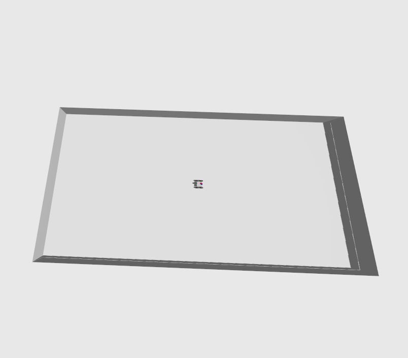
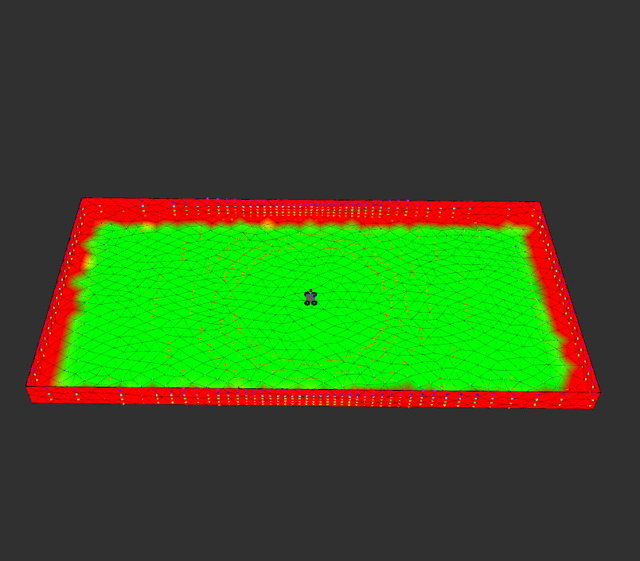
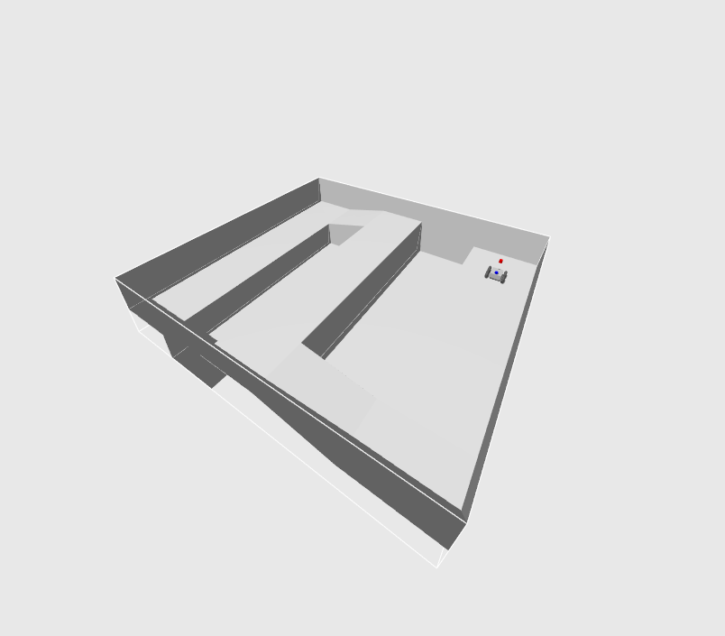
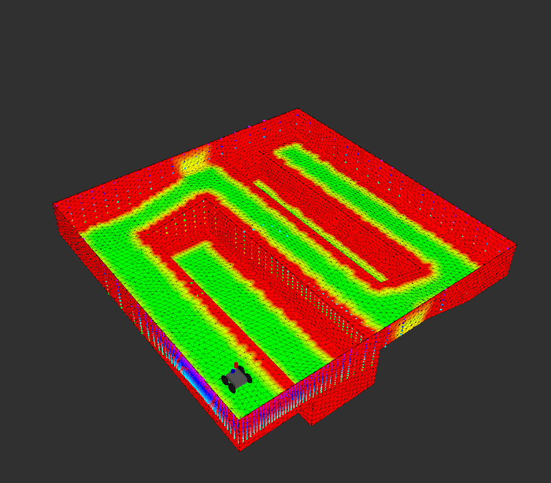
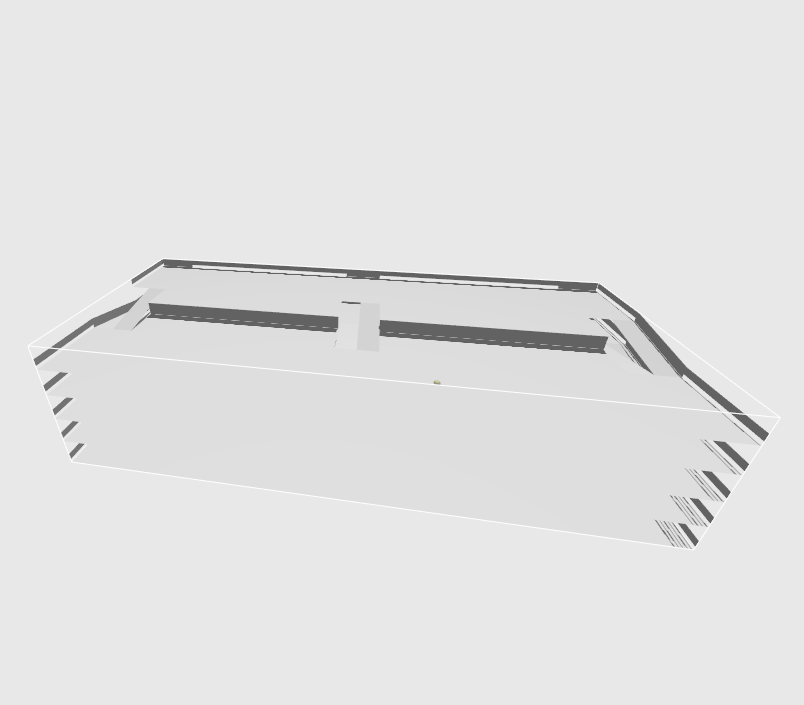
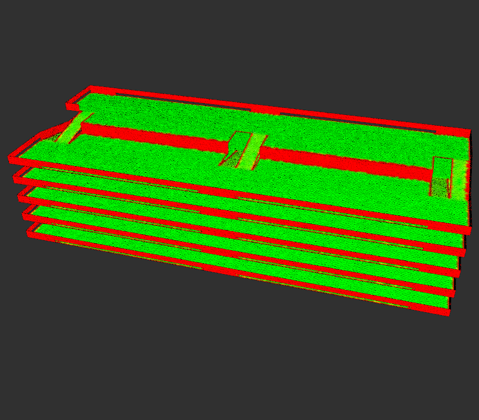

[](https://github.com/naturerobots/mesh_navigation_tutorials/actions/workflows/jazzy.yaml)
[](https://github.com/naturerobots/mesh_navigation_tutorials/actions/workflows/humble.yaml)

<div align="center">
<h1>
Mesh Navigation Tutorials
</h1>
</div>

<div align="center">
  <a href="https://github.com/naturerobots/mesh_navigation">Mesh Navigation</a>
  <span>&nbsp;&nbsp;•&nbsp;&nbsp;</span>
  <a href="https://naturerobots.github.io/mesh_navigation_docs/tutorials">Documentation</a>
  <span>&nbsp;&nbsp;•&nbsp;&nbsp;</span>
  <a href="https://www.youtube.com/@nature-robots">Videos</a>
  <span>&nbsp;&nbsp;•&nbsp;&nbsp;</span>
  <a href="https://github.com/naturerobots/mesh_navigation_tutorials/issues">Issues</a>
  <br />
</div>


<br/>

This repository contains a set of examples to quickly and easily start with [mesh_navigation](https://github.com/naturerobots/mesh_navigation). 
We provide different scenarios where our approach excels over state-of-the art 2D or 2.5D approaches.
We will explain different parameter sets in more detail and show how to fine-tune [mesh_navigation](https://github.com/naturerobots/mesh_navigation) in various scenarios.
Our example worlds consists of both real-world and hand-modelled scenarios.
With the hand-modelled examples we particularly aim to support low-end computers or laptops.


*Note*: Because of an great interest of people we talked to, we decided to release this repository in an unfinished state. It is still under construction and will be extended by more synthetic and real-world recorded worlds and detailed docs. It's open-source: Feel free to contribute.  

## Requirements and Installation

This checkout is a ROS 2 workspace. Its packages and source dependencies are under
`src/`; each package keeps its own `launch/` directory so `ros2 launch <package>
<file>` can find the installed launch files. The workspace-level `launch/`
directory contains standalone launch files.

With ROS 2 Humble installed, run the following commands from this directory:

```bash
source /opt/ros/humble/setup.bash
rosdep install --from-paths src --ignore-src -r -y
colcon build --symlink-install --cmake-clean-cache --packages-up-to mesh_navigation_tutorials
source install/setup.bash
```

To build the vehicle adapter as well, use `colcon build --symlink-install
--cmake-clean-cache --packages-up-to pb_vehicle_adapter` from the same directory.
The cache reset is needed once after moving packages into `src/` because the
existing CMake caches still point to the former source locations.

## Run the Examples

### Launch

```bash
ros2 launch mesh_navigation_tutorials mesh_navigation_tutorials_launch.py world_name:=floor_is_lava
```

You change `floor_is_lava` by any world name that is available with this repository (see all by calling launch file with `--show-args`). Those are: 

| Name | World | Default Map | Description |
|------|-------|-----|-------------|
| tray |  | | This world is a rectangular area with a wall around the perimeter. |
| floor_is_lava |  | | This world contains a square area with with two pits and a connecting section at a slightly higher elevation.
| parking_garage |  | | This world represents a parking garage with multiple floors connected by ramps. |

When running a simulated world, you can save some resources by not running the gazebo GUI: Add the `start_gazebo_gui:=False` launch argument.

### RViz GUI

In rviz, you should be able to see the mesh map.
This map is being used for navigation.

In order to make the robot move, find the "Mesh Goal" tool at the top.
With it, you can click on any part of the mesh.
Click and hold to set a goal pose.
The MbfGoalActions rviz plugin contains a very tiny state machine that performs the following actions:
* subscribe to that goal pose
* get a path to that pose
* execute that path

## Detailed Instructions

For more detailed instructions on how to parameterize things or what things can be changed see the [wiki](https://naturerobots.github.io/mesh_navigation_docs/tutorials/)

## Extended Examples

Additionally, we offer larger maps that better resemble real-world scales:

* [Pluto Maps](./mesh_navigation_pluto/)
* [Ceres Maps](./mesh_navigation_ceres/)

All requires Git LFS to be installed. Under Ubuntu you can simply type:

```bash
sudo apt install git-lfs
```

Find more details about the environments here: [Virtual Worlds](https://naturerobots.github.io/mesh_navigation_docs/tutorials/tutorial_worlds/)

## Related Repositories

* [Move Base Flex](https://github.com/magazino/move_base_flex) ([IROS 2018](https://doi.org/10.1109/IROS.2018.8593829))
* [Mesh Tools](https://github.com/naturerobots/mesh_tools) ([RAS 2021](https://doi.org/10.1016/j.robot.2020.103688))
* [Mesh Navigation](https://github.com/naturerobots/mesh_navigation) ([ICRA 2021 paper for Continuous Vector Field Planner, CVP](https://doi.org/10.1109/ICRA48506.2021.9560981))
* [Rmagine](https://github.com/uos/rmagine) ([ICRA 2023](https://doi.org/10.1109/ICRA48891.2023.10161388))
* [MICP-L](https://github.com/uos/rmcl) ([IROS 2024](https://arxiv.org/abs/2210.13904))
* [RMCL](https://github.com/uos/rmcl)


